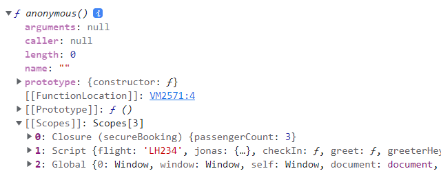

# ✔ '10-Functions' 이론 정리

## ▶ 128. Default Parameters

- function의 default parameters 값으로 expression 가능

  - 중간 default parameter를 건너띄고 인자를 넣고 싶을 때, undefined를 사용하면 default value가 할당됨

    ```js
    const bookings = [];

    const createBooking = function (
      flightNum,
      numPassengers = 1,
      price = 199 * numPassengers
    ) {
      const booking = {
        flightNum,
        numPassengers,
        price,
      };

      console.log(booking);
      bookings.push(booking);
    };

    createBooking('LH123');
    // {flightNum: 'LH123', numPassengers: 1, price: 199}
    createBooking('LH123', 5);
    // {flightNum: 'LH123', numPassengers: 5, price: 995}
    createBooking('LH123', 2, 800);
    // {flightNum: 'LH123', numPassengers: 2, price: 800}
    createBooking('LH123', undefined, 1000);
    // {flightNum: 'LH123', numPassengers: 1, price: 1000}
    ```

## ▶ 129. How Passing Arguments Works: Value vs. Reference

- 'JS에서 function'은 reference가 아닌 'value'로 인자를 받음

  - flightNum = primitive 인자
  - passenger = object 인자

    ```js
    const flight = 'LH234'; // primitive
    const jonas = {
      // object
      name: 'Jonas Schmedtmann',
      passport: 24739479284,
    };

    const checkIn = function (flightNum, passenger) {
      flightNum = 'LH999';
      passenger.name = 'Mr. ' + passenger.name;

      if (passenger.passport === 24739479284) {
        alert('Checked in');
      } else {
        alert('Wrong passport!');
      }
    };
    ```

- primitive parameter는 primitive의 'value'를 참조하게 되고, object parameter는 object의 'value'를 참조하게 됨

  - `const flightNum = flight;`, `const passenger = jonas;` 방식과 동일
  - function 내에서 primitive를 재할당해도 function 밖의 primitive의 value는 변하지 않음
  - function 내에서 object를 재할당하면, function 밖의 object의 value도 변함

    ```js
    checkIn(flight, jonas); // 'Checked in' 경고창이 뜸

    console.log(flight); // LH234
    console.log(jonas); // {name: 'Mr. Jonas Schmedtmann', passport: 24739479284}
    ```

## ▶ 130. First-Class and Higher-Order Functions

1. First-Class Functions

   - JS에서 모든 functions은 단순히 values임
   - functions은 object의 또다른 types일 뿐!
   - 특징
     - functions을 variables이나 object properties로 사용
     - 다른 functions의 인자로 functions을 넣음
     - functions이 functions을 반환함
     - functions는 object이므로, properties와 methods 존재

2. Higher-Order Functions

   - 1. 또다른 function을 인자로 받거나, 2) function을 반환하는 function을 의미
     - function의 인자로 또다른 function을 받는 경우, 이 function 인자를 callback function이라고 부름
   - JS에서는 모든 functions이 단순히 values이기 때문에 가능함

## ▶ 131. Functions Accepting Callback Functions

- Higher-Order Functions: 또 다른 function을 인자로 받는 함수

  - callback function: Higher-Order Functions의 인자로 들어가는 함수로서, Higher-Order Functions에 의해 호출됨

- Higher-Order Functions의 이점

  - callback function 재사용 가능
  - high-level abstraction: callback function에 대한 자세한 코드를 알 필요없이 사용 가능

    ```js
    const oneWord = function (str) {
      return str.replace(/ /g, '').toLowerCase();
    };

    const upperFirstWord = function (str) {
      const [first, ...others] = str.split(' ');
      return [first.toUpperCase(), ...others].join(' ');
    };

    // Higher-order function: transformer()
    // CallBack function: upperFirstWord(), oneWord()
    const transformer = function (str, fn) {
      console.log(`Transformed string: ${fn(str)}`);
      console.log(`Transformed by: ${fn.name}`);
    };

    transformer('JavaScript is the best!', upperFirstWord);
    transformer('JavaScript is the best!', oneWord);
    ```

    ```js
    const high5 = function () {
      console.log('👋');
    };

    // Higher-order function: addEventListener(), forEach()
    // CallBack function: high5()
    document.body.addEventListener('click', high5);
    ['Jonas', 'Martha', 'Adam'].forEach(high5);
    ```

## ▶ 132. Functions Returning Functions

- Higher-Order Functions: function을 반환하는 함수

  ```js
  const greet = function (greeting) {
    return function (name) {
      console.log(`${greeting} ${name}`);
    };
  };

  const greeterHey = greet('Hey');
  greeterHey('Jonas'); // Hey Jonas
  greeterHey('Steven'); // Hey Steven
  greet('Hello')('Jonas'); // Hello Jonas
  ```

  ```js
  // greet function을 arrow function으로 재작성
  const greetArr = greeting => name => console.log(`${greeting} ${name}`);

  greetArr('Hi')('Jonas'); // Hi Jonas
  ```

## ▶ 133. The call and apply Methods

- 한 object의 method를 다른 object에 사용하고 싶다면 어떻게 해야할까?

  - 단순히 method를 regular function으로 가져와 호출하면, this 키워드에 undefined가 할당됨

    ```js
    const lufthansa = {
      airline: 'Lufthansa',
      iataCode: 'LH',
      bookings: [],
      book(flightNum, name) {
        console.log(
          `${name} booked a seat on ${this.airline} flight ${this.iataCode}${flightNum}`
        );
        this.bookings.push({ flight: `${this.iataCode}${flightNum}`, name });
      },
    };

    lufthansa.book(239, 'Jonas Schmedtmann');
    // Jonas Schmedtmann booked a seat on Lufthansa flight LH239
    lufthansa.book(635, 'John Smith');
    // John Smith booked a seat on Lufthansa flight LH635
    console.log(lufthansa);
    // {airline: 'Lufthansa', iataCode: 'LH', bookings: Array(2), book: ƒ}
    ```

    ```js
    const eurowings = {
      airline: 'Eurowings',
      iataCode: 'EW',
      bookings: [],
    };

    const book = lufthansa.book;
    book(23, 'Sarah Williams');
    // Sarah Williams booked a seat on undefined flight undefined23
    // Uncaught TypeError: Cannot read properties of undefined (reading 'push')
    ```

### 🔹 `call` Method

- function의 methods 중 하나
- `함수명.call(thisArg, arg1, ... , argN)`: function의 `this` 키워드가 첫번째 인자를 가리키도록 함
  - 첫 번째 인자 `thisArg`: 함수를 호출할 때 `this`의 value가 되는 값
  - 나머지 인자들 `arg1 ~ N`: 함수의 인자들
- 즉, 함수를 호출하는 대상을 `thisArg`로 지정함

  ```js
  book.call(eurowings, 23, 'Sarah Williams');
  // Sarah Williams booked a seat on Eurowings flight EW23
  console.log(eurowings);
  // {airline: 'Eurowings', iataCode: 'EW', bookings: Array(1)}
  ```

  ```js
  book.call(lufthansa, 239, 'Mary Cooper');
  // Mary Cooper booked a seat on Lufthansa flight LH239
  console.log(lufthansa);
  // {airline: 'Lufthansa', iataCode: 'LH', bookings: Array(3), book: ƒ}
  ```

### 🔹 `apply` Method

- function의 methods 중 하나
- `call` Methods과 동일한 기능을 함
  - 차이점: `call` Methods는 인수들 각각을 인자로 받지만, `apply` Methods는 인수들의 단일 array를 인자로 받음
  - modern JS에선 `apply` Methods보단 `call` Methods를 사용하는 것을 선호
- `함수명.apply(thisArg, argsArray)`: function의 `this` 키워드가 첫번째 인자를 가리키도록 함

  - 첫 번째 인자 `thisArg`: 함수를 호출할 때 `this`의 value가 되는 값
  - 두 번째 인자 `argsArray`: 함수의 인자들을 담은 array

  ```js
  const flightData = [583, 'George Cooper'];

  book.apply(eurowings, flightData);
  // George Cooper booked a seat on Eurowings flight EW583
  console.log(eurowings);
  // {airline: 'Eurowings', iataCode: 'EW', bookings: Array(2)}
  ```

  ```js
  book.call(eurowings, ...flightData);
  // George Cooper booked a seat on Eurowings flight EW583
  ```

## ▶ 134. The bind Method

### 🔹 `bind` Method

- function의 methods 중 하나
- `call`/`apply` Method처럼 function의 `this` 키워드가 첫번째 인자를 가리키도록 함
  - 차이점: `call`/`apply` Method는 바로 함수를 호출하는데 반해, `bind` Method는 function을 반환함
- `함수명.bind(thisArg, [arg1, ..., argN])`: function의 `this` 키워드가 첫번째 인자를 가리키도록 한 **또 다른 function을 반환**

  - 첫 번째 인자 `thisArg`: 함수를 호출할 때 `this`의 value가 되는 값
  - 나머지 인자들 `arg1 ~ N`: 미리 지정할 함수의 인자들 (preset arguments) 👉 `Partial application`을 가능하게 함

  ```js
  const bookLH = book.bind(lufthansa);
  const bookEW = book.bind(eurowings);

  bookEW(23, 'Steven Williams');
  // Steven Williams booked a seat on Eurowings flight EW23
  ```

  ```js
  const bookEW23 = book.bind(eurowings, 23); // preset arguments

  bookEW23('Jonas Schmedtmann');
  // Jonas Schmedtmann booked a seat on Eurowings flight EW23
  bookEW23('Martha Cooper');
  // Martha Cooper booked a seat on Eurowings flight EW23
  ```

- Event Listeners와 사용할 때 유용

  - 이유1) event listener로 정의된 함수만 넣어야 함
    - 함수를 호출해서는 안됨 (`call`/`apply` Method 사용 x)
  - 이유2) event listener에서의 `this`는 handler가 붙어진 DOM 요소를 가리킴
    - 따라서, `bind` method를 사용해서 `this`의 value를 직접 지정해야 함

  ```js
  lufthansa.planes = 300;
  lufthansa.buyPlane = function () {
    console.log(this);

    this.planes++;
    console.log(this.planes);
  };
  ```

  ```js
  // Bad Code!
  document.querySelector('.buy').addEventListener('click', lufthansa.buyPlane);
  // <button class="buy">Buy new plane 🛩</button>
  // NaN
  ```

  ```js
  // Correct Code!
  document
    .querySelector('.buy')
    .addEventListener('click', lufthansa.buyPlane.bind(lufthansa));
  // {airline: 'Lufthansa', iataCode: 'LH', bookings: Array(0), planes: 300, book: ƒ, …}
  // 301
  ```

- Partial Application Function 생성 가능

  - Partial Application Function: 미리 지정된 초기 인수가 있는 함수

  ```js
  const addTax = (rate, value) => value + value * rate;
  const addVAT = addTax.bind(null, 0.23);
  // addVAT = value => value + value * 0.23; 와 동일

  console.log(addVAT(100)); // 123
  ```

  ```js
  // bind() method 사용하지 않고 직접 addVAT() 함수 만들기
  const addTaxRate = function (rate) {
    return function (value) {
      return value + value * rate;
    };
  };

  const addVAT2 = addTaxRate(0.23);

  console.log(addVAT2(100)); // 123
  ```

## ▶ 136. Immediately Invoked Function Expressions (IIFE)

- Immediately Invoked Function Expressions (IIFE)

  - 딱 한번 즉시 호출되는 function
  - 변수 할당없이 대괄호로 감싼 상태로 바로 호출

  ```js
  // 1) function expression
  (function () {
    console.log('This will never run again');
  })();
  ```

  ```js
  // 2) arrow function
  (() => console.log('This will ALSO never run again'))();
  ```

- IIFE의 이점

  - scope을 만들어주기 때문에, 외부에서 function 내 특정 values에 접근하지 못하게 막을 수 있음 (encapsulation)
  - ES6부터는 block-scope인 `const`, `let` 키워드를 사용해 IIFE를 사용하지 않고도 encapsulation 가능해짐

  ```js
  (function () {
    const isPrivate = 23;
  })();

  console.log(isPrivate);
  // Uncaught ReferenceError: isPrivate is not defined
  ```

  ```js
  {
    const isPrivate = 23;
  }

  console.log(isPrivate);
  // Uncaught ReferenceError: isPrivate is not defined
  ```

## ▶ 137. Closures

- Closure: function이 생성될 때, 이때의 execution context 안에 있는 closed-over variable environment을 가리킴 (심지어 해당 EC가 사라져도 유지)
  - Closure는 object나 function처럼 우리가 직접 생성할 수 있는게 아니라, JS engine에 의해 자동으로 생성됨
  - 심지어 우리는 closed-over variables에 접근할 수도 없음
- parent function이 A function을 return한 이후에도, Closure에 의해 A function은 parent function의 모든 variables에 접근이 가능함
  - 즉, A function은 outer scope에 대한 reference(connection)를 항상 유지하고 있음
- 아래 코드에서 booker() 함수가 호출되면, Closure에서 passengerCount 변수를 찾음

  ```js
  const secureBooking = function () {
    let passengerCount = 0;

    return function () {
      passengerCount++;
      console.log(`${passengerCount} passengers`);
    };
  };

  const booker = secureBooking();

  booker(); // 1 passengers
  booker(); // 2 passengers
  ```

- `console.dir()`을 사용하면, 아래와 같이 closure를 확인할 수 있음

  ```js
  console.dir(booker);
  ```

  

## ▶ 138. More Closure Examples

- closure를 가지는 function이 재할당되면, 이전 closure는 사라지고 새롭게 생성됨

  ```js
  let f;

  const g = function () {
    const a = 23;
    f = function () {
      console.log(a * 2);
    };
  };

  const h = function () {
    const b = 777;
    f = function () {
      console.log(b * 2);
    };
  };

  g();
  f(); // 46
  console.dir(f); // closure 👉 {a: 23}

  h();
  f(); // 1544
  console.dir(f); // closure 👉 {b: 777}
  ```

- scope chain보다 closure의 우선순위가 더 높음

  - 즉, setTimeout 함수 내 callback function이 실행될 때 perGroup 변수를 global chain보다 closure에서 먼저 찾음

  ```js
  const boardPassengers = function (n, wait) {
    const perGroup = n / 3;

    setTimeout(function () {
      console.log(`We are now boarding all ${n} passengers`);
      console.log(`There are 3 groups, each with ${perGroup} passengers`);
    }, wait * 1000);

    console.log(`Will start boarding in ${wait} seconds`);
  };

  const perGroup = 1000;
  boardPassengers(180, 3);
  // Will start boarding in 3 seconds
  // There are 3 groups, each with 60 passengers
  ```
