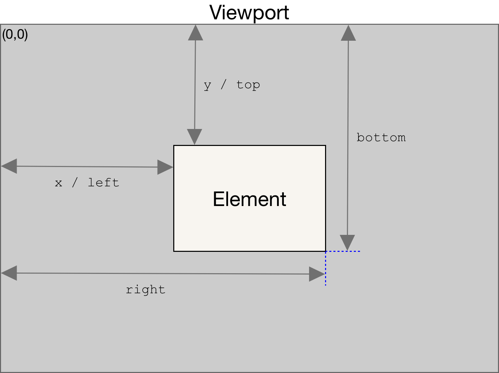

# ✔ '13-Advanced-DOM-Bankist' 이론 정리

## ▶ 184. PROJECT: "Bankist" Website

- `Bankist` 웹사이트의 홈페이지를 만들어보자

  - 모달, scroll event, 슬라이더, tabs 등의 기능 구현 필요
  - 사이트 링크: <https://bankist-dom.netlify.app/>

## ▶ 185. How the DOM Really Works

### 🔹 DOM

- JS와 브라우저가 interact하게 해주는 API
- JS를 통해 HTML elements를 생성/수정/삭제할 수 있고, style/class/attribute를 설정 및 events 설정도 가능
- HTML document로부터 DOM tree가 생성됨
- DOM은 DOM tree와 상호작용할 수 있게 매우 많은 methods와 properties를 가지고 있는 복잡한 API임
  - ex) `.querySelector()`, `.addEventListener()`, `.createElement()`,
    `.innerHTML`, `.textContent`, `.children` 등

### 🔹 DOM object의 types

- DOM tree는 모두 Nodes로 구성되어 있음
- Node는 `Element`, `Text`, `Comment`, `Document` 4가지 타입이 존재

  ```
  EventTarget
        ↳ Node
            ↳ Element  →  HTMLElement
                                ↳ HTMLButtonElement
                                ↳ HTMLDivElement
                                ↳ ...
            ↳ Text
            ↳ Comment
            ↳ Document
        ↳ Window
  ```

- Node는 JS object로서 많은 methods와 properties를 가지고 있음
- 아래 methods와 properties는 부모에서 자식/자손으로 상속됨

1. `EventTarget`

   - `.addEventListener()`, `.removeEventListener()` methods 가지고 있음

2. `Node`

   - `.textContent`, `.childNodes`, `.parentNode`, `.cloneNode()` methods와 properties를 가지고 있음

3. `Window`

   - Global object
   - DOM과 관련없는 많은 methods와 properties를 가지고 있음

4. `Element`

   - `.innerHTML`, `.classList`, `.children`, `.parentElement`, `.append()`, `.remove()`, `.insertAdjacentHTML()`, `.querySelector()`, `.closest()`, `.matches()`, `.scrollIntoView()`, `.setAttribute()` methods와 properties를 가지고 있음

5. `Document`

   - `.querySelector()`, `.createElement()`, `.getElementById()` methods와 properties를 가지고 있음

## ▶ 186. Selecting, Creating, and Deleting Elements

### 🔹 Selecting Elements

1. `document.documentElement`

   - 문서의 루트 요소를 나타내는 Element를 반환

   ```js
   console.log(document.documentElement);
   // <html>
   //   <head></head>
   //   <body></body>
   // </html>
   ```

2. `document.head`

   - 현재 문서의 <head> 요소를 나타냄

   ```js
   console.log(document.head);
   // <head></head>
   ```

3. `document.body`

   - 현재 문서의 <body> 혹은 <frameset> 노드를 나타냄

   ```js
   console.log(document.body);
   // <body></body>
   ```

4. `document.querySelector(selectors)`

   - 제공한 선택자 또는 선택자 뭉치와 일치하는 문서 내 첫 번째 Element를 반환

   ```js
   const header = document.querySelector('.header');
   ```

5. `document.querySelectorAll(selectors)`

   - 지정된 셀렉터 그룹에 일치하는 다큐먼트의 엘리먼트 리스트를 나타내는
     'NodeList'를 반환

   ```js
   const allSections = document.querySelectorAll('.section');
   ```

6. `document.getElementById(id명)`

   - 주어진 문자열과 일치하는 id 속성을 가진 요소를 찾고, 이를 나타내는 Element 객체를 반환

   ```js
   document.getElementById('section--1');
   ```

7. `document.getElementsByTagName(tag명)`

   - 주어진 태그명에 해당하는 엘리먼트를 모두 포함한 'HTMLCollection'을 반환

   ```js
   const allButtons = document.getElementsByTagName('button');
   ```

8. `document.getElementsByClassName(class명)`

   - 주어진 클래스를 가진 모든 자식 엘리먼트의 실시간 'HTMLCollection'을 반환

   ```js
   document.getElementsByClassName('btn');
   ```

### 🔹 Creating and Inserting Elements

1. `document.createElement(tagName[, options])`

   - 지정한 tagName의 HTML 요소를 만들어 반환

   ```js
   const message = document.createElement('div');
   message.classList.add('cookie-message');
   ```

2. `Node.textContent`

   - 노드와 그 자손의 텍스트 콘텐츠를 표현

   ```js
   message.textContent =
     'We use cookied for improved functionality and analytics.';
   ```

3. `Element.innerHTML`

   - 요소(element) 내에 포함 된 HTML/XML 마크업을 가져오거나 설정

   ```js
   message.innerHTML =
     'We use cookied for improved functionality and analytics. <button class="btn btn--close-cookie">Got it!</button>';
   ```

4. `Element.prepend(param1[, param2, ..., paramN])`

   - Node objects나 string objects를 지정한 element의 첫번째 자식 element 앞에 삽입

   ```js
   header.prepend(message);
   ```

5. `Element.append(param1[, param2, ..., paramN])`

   - Node objects나 string objects를 지정한 element의 마지막 자식 element 뒤에 삽입
   - 단 아래 header 요소는 DOM 상에 하나만 존재해야하므로, 앞에 prepend에 따른 실행은 취소되고 아래 코드가 실행됨
   - 동일한 요소를 여러 위치에 두고 싶다면, `cloneNode()`를 통해 복사하면 됨

   ```js
   header.append(message);
   ```

6. `Node.cloneNode(deep)`

   - node를 복제해 새로운 node를 반환
     - `deep`: true이면, child nodes도 전부 복제됨

   ```js
   header.append(message.cloneNode(true));
   ```

7. `Element.before(param1[, param2, ..., paramN])`

   - Node objects나 string objects를 지정한 element의 앞에 삽입

   ```js
   header.before(message);
   ```

8. `Element.after(param1[, param2, ..., paramN])`

   - Node objects나 string objects를 지정한 element의 뒤에 삽입

   ```js
   header.after(message);
   ```

### 🔹 Deleting Elements

1. `Element.remove()`

   - 지정한 element를 삭제함

   ```js
   document
     .querySelector('.btn--close-cookie')
     .addEventListener('click', function () {
       message.remove();
     });
   ```

2. `Node.removeChild(child)`

   - child node를 삭제함
   - 위 1번 코드와 같은 결과

   ```js
   document
     .querySelector('.btn--close-cookie')
     .addEventListener('click', function () {
       message.parentElement.removeChild(message);
     });
   ```

### 🔹 NodeList vs HTMLCollection

- NodeList: DOM에 새로운 요소가 추가되도 update되지 않음 (정적)
- HTMLCollection: DOM에 새로운 요소가 추가되면 update됨 (동적)

## ▶ 187. Styles, Attributes and Classes

### 🔹 Styles

1. `HTMLElement.style`

   - 지정한 element의 'inline' style만을 반환 가능하고, 'inline' style 설정 가능

   ```js
   message.style.backgroundColor = '#37383d';
   message.style.width = '120%';

   console.log(message.style.backgroundColor); // rgb(55, 56, 61)
   console.log(message.style.color); // ''
   ```

2. `Window.getComputedStyle(element)`

   - 인자로 전달받은 요소의 모든 CSS 속성값을 담은 객체를 반환

   ```js
   console.log(getComputedStyle(message).color); // rgb(55, 56, 61)
   console.log(getComputedStyle(message).height); // 43.6667px
   ```

   ```js
   message.style.height =
     Number.parseFloat(getComputedStyle(message).height, 10) + 30 + 'px';
   ```

3. `CSSStyleDeclaration.setProperty(propertyName, value)`

   - 새로운 css style 값을 설정
   - `propertyName`: 바꾸고자하는 CSS property 명
   - `value`: 새롭게 바꾸고자하는 property name

   ```js
   document.documentElement.style.setProperty('--color-primary', 'orangered');
   ```

### 🔹 Attributes

1. `Element.attribute명`

   - element에 적절하지 않은 속성을 기입한 경우, 아래 코드를 통해선 해당 attribute에 대한 value를 얻을 수 없음
   - `src`나 `href` 속성의 url 값을 '절대 경로'로 가져옴
   - Data attributes: elements에 추가 정보를 저장하기 위한 용도로 사용됨

   ```html
   
   ```

   ```js
   const logo = document.querySelector('.nav__logo');

   console.log(logo.alt); // Bankist logo
   console.log(logo.className); // nav__logo
   console.log(logo.designer); // undefined
   console.log(logo.src); // http://127.0.0.1:5500/13-Advanced-DOM-Bankist/final/img/logo.png
   console.log(logo.dataset.versionNumber); // 3.0
   ```

   ```js
   logo.alt = 'Beautiful minimalist logo';
   ```

2. `Element.getAttribute(attribute명)`

   - 지정한 attribute의 값을 반환
   - `src`나 `href` 속성의 url 값을 '상대 경로'로 가져옴

   ```js
   console.log(logo.getAttribute('designer')); // "Jonas"
   console.log(logo.getAttribute('src')); // img/logo.png
   ```

3. `Element.setAttribute(attribute명, value)`

   - element의 특정 attribute에 대한 value를 성정

   ```js
   logo.setAttribute('company', 'Bankist');
   ```

### 🔹 Classes

1. `Element.classList`

   - `add`, `remove`, `toggle`, `contains` 메서드 존재

   ```js
   logo.classList.add('c', 'j');
   logo.classList.remove('c', 'j');
   logo.classList.toggle('c');
   logo.classList.contains('c');
   ```

## ▶ 188. Implementing Smooth Scrolling

### 🔹 Scroll 관련 properties/methods

1. `Element.getBoundingClientRect()`

   - 엘리먼트의 크기와 뷰포트에 '상대적'인 위치 정보를 제공하는 DOMRect 객체를 반환
   - `left`, `top`, `right`, `bottom`, `x`, `y`, `width`, `height` 프로퍼티

     - `width`와 `height`가 아닌 다른 프로퍼티는 뷰포트의 top-left에 상대적

     

   ```js
   const section1 = document.querySelector('#section--1');
   const s1coords = section1.getBoundingClientRect();

   console.log(s1coords);
   // DOMRect {x: 0, y: 219, width: 664, height: 2327.1875, top: 219, …}
   ```

2. `window.pageXOffset`, `window.pageYOffset`

   - 문서가 수평/수직으로 얼마나 스크롤됐는지 픽셀 단위로 반환
   - `window.scrollX`, `window.scrollY`와 동일

   ```js
   console.log('Current scroll (X/Y)', window.pageXOffset, window.pageYOffset);
   // Current scroll (X/Y) 0 386
   ```

3. `Element.clientWidth`, `Element.clientHeight`

   - 엘리먼트의 내부 너비/높이를 픽셀로 나타냄
   - 내부 너비/높이: 안쪽 여백(패딩)까지 포함
     - 테두리, 바깥 여백(마진), 수직/수평 스크롤바의 너비/높이는 포함하지 않음

   ```js
   console.log(
     'height/width viewport',
     document.documentElement.clientHeight,
     document.documentElement.clientWidth
   );
   // height/width viewport 241 664
   ```

4. `Element.scrollTo(x-coord, y-coord)` or `Element.scrollTo(options)`

   - 주어진 Element 내부에서 해당 좌표(x-coord, y-coord) 위치로 스크롤

     - `options`: `top`, `left`, `behavior` parameters가 존재하는 object
     - `behavior`: `smooth`, `instant`, `auto` 종류 존재

   - Bankist app에서 'learn more' 버튼 클릭 시, 첫번째 section으로 스크롤되게 하기 (오래된 방법)

   ```js
   // 방법1) Element.scrollTo(x-coord, y-coord)
   btnScrollTo.addEventListener('click', function (e) {
     window.scrollTo(
       s1coords.left + window.pageXOffset,
       s1coords.top + window.pageYOffset
     );
   });
   ```

   ```js
   // 방법2) Element.scrollTo(options)
   btnScrollTo.addEventListener('click', function (e) {
     window.scrollTo({
       left: s1coords.left + window.pageXOffset,
       top: s1coords.top + window.pageYOffset,
       behavior: 'smooth',
     });
   });
   ```

5. `Element.scrollIntoView(scrollIntoViewOptions)`

   - element 위치로 스크롤

     - `scrollIntoViewOptions`: `behavior`, `block`, `inline` properties를 가지는 object
     - `behavior`: `smooth`, `instant`, `auto` 종류 존재
     - `block`: 수직 정렬 방식(`start`, `center`, `end`, `nearest`)
     - `inline`: 수평 정렬 방식(`start`, `center`, `end`, `nearest`)

   - Bankist app에서 'learn more' 버튼 클릭 시, 첫번째 section으로 스크롤되게 하기 (최신 방법)

   ```js
   btnScrollTo.addEventListener('click', function (e) {
     section1.scrollIntoView({ behavior: 'smooth' });
   });
   ```

## ▶ 189. Types of Events and Event Handlers

### 🔹 Event 처리 방법

1. HTML element 속성으로 event handler 등록

   ```html
   <h1 onclick="alert('HTML alert')"></h1>
   ```

2. DOM element의 property로 등록

   ```js
   const h1 = document.querySelector('h1');

   h1.onmouseenter = function (e) {
     alert('onmouseenter: Great! You are reading the heading :D');
   };
   ```

3. `ElementTarget.addEventListener(type, listener, options)`

   - 지정한 event가 target에 전달됐을 때, 함수를 호출함
     - `type`: event type
     - `listener`: 특정 event type이 일어났을 때, 호출할 함수
     - `options`: event listener에 추가되는 특징을 담은 object
       - `capture`, `once`, `passive`
   - 셋 중 가장 선호되는 방법임
     - 이유 1) 한 element target에 하나의 event에 대한 listener를 여러 개 붙일 수 있음
     - 이유 2) eventListener 삭제 가능

   ```js
   const alertH1 = function (e) {
     alert('addEventListener: Great! You are reading the heading :D');
   };

   h1.addEventListener('mouseenter', alertH1);

   setTimeout(() => h1.removeEventListener('mouseenter', alertH1), 3000);
   ```

## ▶ 190. Event Propagation: Bubbling and Capturing

- DOM event 흐름엔 아래 3가지 단계가 있음

1. Capturing 단계

   - 이벤트가 하위 요소로 전파되는 단계

2. Target 단계

   - 이벤트가 실제 타깃 요소에 전파되는 단계

3. Bubbling 단계

   - 이벤트가 상위 요소로 전파되는 단계
   - 한 element에 event가 발생하면, 가장 최상단의 조상 요소를 만날 때까지 event가 전파되면서 element 각각에 할당된 handler가 동작함
   - 즉, 상위 요소에 전해지는 event는 타깃 요소로부터 기인된 것임

## ▶ 191. Event Propagation in Practice

- `event.target` vs `event.currentTarget`

  - `event.target`: 이벤트가 발생한 target 요소 (bubbling이 진행되어도 변하지 x)
  - `event.currentTarget`: 현재 실행 중인 handler가 할당된 요소 (= `this` 키워드)

- `event.stopPropagation()`를 사용해 bubbling 중단 가능

  - 하지만, 추후에 버블링이 필요한 경우가 생기기 때문에 이 방법은 선호하지 않음

- `addEventListener(type, listener, options)`는 default로 options이 `{capture: false}`임

  - 따라서, 기본적으로 'target' event와 'bubbling' event만 감지함
  - `{capture: true}`로 변경하면, 'target' event와 'capturing' event를 감지하게 됨
  - 하지만, 캡쳐링 단계는 거의 사용하지 않고 주로 버블링 단계의 이벤트만 다뤄짐

- 아래 코드에서 `.nav__link` 요소를 클릭하면, 버블링에 의해 상위 요소인 `.nav__links`, `.nav` 요소의 배경색도 변하게 됨

  ```js
  // 아래 실습을 위해 필요한 함수
  const randomInt = (min, max) =>
    Math.floor(Math.random() * (max - min + 1) + min);

  const randomColor = () =>
    `rgb(${randomInt(0, 255)},${randomInt(0, 255)},${randomInt(0, 255)})`;
  ```

  ```js
  document.querySelector('.nav__link').addEventListener('click', function (e) {
    this.style.backgroundColor = randomColor();
    console.log('LINK', e.target, e.currentTarget);
    // 'LINK' <a>...</a> <a>...</a>
    console.log(e.currentTarget === this); // true

    // e.stopPropagation();
  });

  document.querySelector('.nav__links').addEventListener('click', function (e) {
    this.style.backgroundColor = randomColor();
    console.log('CONTAINER', e.target, e.currentTarget);
    // 'CONTAINER' <a>...</a> <ul>...</ul>
  });

  document.querySelector('.nav').addEventListener('click', function (e) {
    this.style.backgroundColor = randomColor();
    console.log('NAV', e.target, e.currentTarget);
    // 'NAV' <a>...</a> <nav>...</nav>
  });
  ```

## ▶ 192. Event Delegation: Implementing Page Navigation

- `.nav__link` 요소를 클릭했을 때, 각 요소에 맞는 section 위치로 스크롤되게 하자

  - 만약 `.nav__link` 요소가 1,000개 있다면, 각각에 따로 event handler를 달아줘야하므로 비효율적
  - Event Delegation을 이용해 효율적으로 이벤트 핸들링 가능

  ```js
  document.querySelectorAll('.nav__link').forEach(function (el) {
    el.addEventListener('click', function (e) {
      e.preventDefault();
      const id = this.getAttribute('href');
      document.querySelector(id).scrollIntoView({ behavior: 'smooth' });
    });
  });
  ```

### 🔹 Event Delegation

- Capturing과 Bubbling을 활용하면, 강력한 event handling 패턴인 Event Delegation(이벤트 위임) 구현 가능
- 각 element마다 handler를 할당하지 않고, handler를 달고자하는 모든 element의 **공통 조상에 even handler 단 하나만 할당**해도 여러 요소를 한꺼번에 다룰 수 있음

  - 1. '공통 조상 요소'에 event listener를 달아주자
  - 2. `event.target`을 이용해 실제 어디서 이벤트가 발생했는지 확인하자

- Event Delegation을 이용해 위 코드 리팩토링

  ```js
  document.querySelector('.nav__links').addEventListener('click', function (e) {
    e.preventDefault();

    // Matching strategy
    if (e.target.classList.contains('nav__link')) {
      const id = e.target.getAttribute('href');
      document.querySelector(id).scrollIntoView({ behavior: 'smooth' });
    }
  });
  ```

## ▶ 193. DOM Traversing

### 🔹 Going downwards (child)

1. `Element.childNodes`

   - element의 모든 children nodes를 NodeList 형태로 반환

   ```js
   const h1 = document.querySelector('h1');

   console.log(h1.childNodes);
   // NodeList(9) [text, comment, text, span.highlight, text, br, text, span.highlight, text]
   ```

2. `Element.children`

   - element의 모든 children elements를 HTMLCollection 형태로 반환

   ```js
   console.log(h1.children);
   // HTMLCollection(3) [span.highlight, br, span.highlight]
   ```

3. `Element.firstElementChild` / `Element.lastElementChild`

   - element의 children 중 첫번째/마지막 element를 반환
   - child element가 없으면 `null`을 반환

   ```js
   h1.firstElementChild.style.color = 'white';
   h1.lastElementChild.style.color = 'orangered';
   ```

4. `Element.querySelector(selector)` / `Element.querySelectorAll(selector)`

   - element의 children 중 selector와 일치하는 첫번째 element를 반환
   - element의 children 중 selector와 일치하는 모든 elements를 NodeList 형태로 반환

   ```js
   console.log(h1.querySelectorAll('.highlight'));
   // NodeList(2) [span.highlight, span.highlight]
   ```

### 🔹 Going upwards: parents

1. `Node.parentNode`

   - 특정 node의 parent node를 반환

   ```js
   console.log(h1.parentNode);
   ```

2. `Node.parentElement`

   - 특정 node의 parent element를 반환

   ```js
   console.log(h1.parentElement);
   // <div class='header__title'>...</div>
   ```

3. `Element.closest(selector)`

   - element 자신과 parent elements 중 selector와 일치하는 첫번째 element를 반환

   ```js
   h1.closest('.header').style.background = 'var(--gradient-secondary)';
   h1.closest('h1').style.background = 'var(--gradient-primary)';
   ```

### 🔹 Going sideways: siblings

1. `Element.previousElementSibling` / `Element.nextElementSibling`

   - element의 바로 전/후 element를 반환
   - 없으면 `null`을 반환

   ```js
   console.log(h1.previousElementSibling);
   // null
   ```

   ```js
   console.log(h1.nextElementSibling);
   // <h4>...</h4>
   ```

2. `Node.previousSibling` / `Node.nextSibling`

   - node의 바로 전/후 node를 반환
   - 없으면 `null`을 반환

   ```js
   console.log(h1.previousSibling);
   // #text
   ```

   ```js
   console.log(h1.nextSibling);
   // #text
   ```

3. 부모 요소의 모든 자식 요소를 가져오는 방법도 있음

   ```js
   console.log(h1.parentElement.children);
   // HTMLCollection(4) [h1, h4, button.btn--text.btn--scroll-to, img.header__img]
   ```

## ▶ 194. Building a Tabbed Component

- 'operations' tap component를 만들어보자

  - tab 버튼 각각에 event handler를 달지 말고, 공통 부모 요소인 'operations\_\_tab-container'에만 하나 달아주자 (event delegation)
  - 'operations\_\_tab' 버튼 내부에 `<span>` 태그를 클릭해도 버튼을 클릭한 것과 처리해야함

  ```js
  const tabs = document.querySelectorAll('.operations__tab');
  const tabsContainer = document.querySelector('.operations__tab-container');
  const tabsContent = document.querySelectorAll('.operations__content');

  tabsContainer.addEventListener('click', function (e) {
    const clicked = e.target.closest('.operations__tab');

    // Guard clause
    if (!clicked) return;

    // Remove active classes
    tabs.forEach(t => t.classList.remove('operations__tab--active'));
    tabsContent.forEach(c => c.classList.remove('operations__content--active'));

    // Activate tab
    clicked.classList.add('operations__tab--active');

    // Activate content area
    document
      .querySelector(`.operations__content--${clicked.dataset.tab}`)
      .classList.add('operations__content--active');
  });
  ```

## ▶ 195. Passing Arguments to Event Handlers

- 각 'nav\_\_link'를 호버했을 때, 호버한 링크를 제외한 나머지 링크들과 로고의 투명도를 낮추자

  - 'mouseenter' event는 bubbling이 안되므로, 'mouseover' event를 적용
  - 'mouseenter' ↔ 'mouseleave', 'mouseover' ↔ 'mouseout'
  - 'mouseout'될 때, 투명도를 원래대로 돌려놔야함
  - 아래 코드는 handler가 비슷하게 반복되므로 효율적이지 못한 코드임

  ```js
  const nav = document.querySelector('.nav');

  nav.addEventListener('mouseover', function (e) {
    if (e.target.classList.contains('nav__link')) {
      const link = e.target;
      const siblings = link.closest('.nav').querySelectorAll('.nav__link');
      const logo = link.closest('.nav').querySelector('img');

      siblings.forEach(el => {
        if (el !== link) el.style.opacity = 0.5;
      });
      logo.style.opacity = 0.5;
    }
  });

  nav.addEventListener('mouseout', function (e) {
    if (e.target.classList.contains('nav__link')) {
      const link = e.target;
      const siblings = link.closest('.nav').querySelectorAll('.nav__link');
      const logo = link.closest('.nav').querySelector('img');

      siblings.forEach(el => {
        if (el !== link) el.style.opacity = 1;
      });
      logo.style.opacity = 1;
    }
  });
  ```

- 리팩토링1) handler를 따로 추출해 함수화한 후, 익명함수로 한번 더 감싸자

  ```js
  const handleHover = function (e, opacity) {
    if (e.target.classList.contains('nav__link')) {
      const link = e.target;
      const siblings = link.closest('.nav').querySelectorAll('.nav__link');
      const logo = link.closest('.nav').querySelector('img');

      siblings.forEach(el => {
        if (el !== link) el.style.opacity = opacity;
      });
      logo.style.opacity = opacity;
    }
  };

  nav.addEventListener('mouseover', function (e) {
    handleHover(e, 0.5);
  });
  nav.addEventListener('mouseout', unction (e) {
    handleHover(e, 1);
  });
  ```

- 리팩토링2) `bind` method를 사용해 handler에 "argument"를 preset한 함수를 만들자

  - `함수명.bind(thisArg, [arg1, ..., argN])`

  ```js
  const handleHover = function (e) {
    if (e.target.classList.contains('nav__link')) {
      const link = e.target;
      const siblings = link.closest('.nav').querySelectorAll('.nav__link');
      const logo = link.closest('.nav').querySelector('img');

      siblings.forEach(el => {
        if (el !== link) el.style.opacity = this;
      });
      logo.style.opacity = this;
    }
  };

  // Passing "argument" into handler
  nav.addEventListener('mouseover', handleHover.bind(0.5));
  nav.addEventListener('mouseout', handleHover.bind(1));
  ```

## ▶ 196. Implementing a Sticky Navigation: The Scroll Event

- `section--1`까지 스크롤을 내렸을 때, 네브바가 화면 상단에 나타나도록 하자

  - 사실, 스크롤될 때마다 handler가 호출되므로 'scroll' event를 사용하는 것은 상당히 비효율적

  ```js
  const initialCoords = section1.getBoundingClientRect();

  window.addEventListener('scroll', function () {
    if (window.scrollY > initialCoords.top) nav.classList.add('sticky');
    else nav.classList.remove('sticky');
  });
  ```

- `Intersection Observer API`를 사용하면 scroll event를 더 효율적으로 처리 가능

## ▶ 197. A Better Way: The Intersection Observer API

> 참고: [Intersection Observer - 요소의 가시성 관찰](https://heropy.blog/2019/10/27/intersection-observer/)

### 🔹 Intersection Observer API

- 'target 요소'와 '특정 요소 또는 브라우저 viewport'의 교차점을 관찰
  - 즉 'target 요소'와 '브라우저 viewport'의 교차점을 관찰한다고 하면, 사용자 화면에 target 요소가 보이는지 여부를 판단해줌
- 비동기적으로 실행되기 때문에, 위 코드처럼 scroll event에 대한 handler 연속 호출과 같은 문제 없이 사용 가능

- 새로 인스턴스를 생성해 관찰자(observer)를 초기화하고 관찰할 대상을 지정

  - `callback(entries, observer)`: 관찰할 대상(target)이 등록되거나 visibility에 변화가 생기면 observer는 callback function을 실행함
  - `options`: callback function을 실행시킬만한 관찰할 대상(target)의 교차 조건

  ```js
  const obsCallback = function (entries, observer) {
    entries.forEach(entry => {
      console.log(entry);
    });
  };

  const obsOptions = {
    root: null,
    threshold: [0, 0.2],
  };

  const observer = new IntersectionObserver(obsCallback, obsOptions); // 관찰자 초기화
  observer.observe(section1); // 관찰할 대상(요소) 등록
  ```

- `entries`: IntersectionObserverEntry 인스턴스의 '배열'

  - 즉, `entry`는 IntersectionObserverEntry (object)로 관찰된 한 intersection change임
  - `entry`의 속성
    - `boundingClientRect`: 관찰 대상의 사각형 정보
    - `intersectionRect`: 관찰 대상의 교차한 영역 정보
    - `intersectionRatio`: 관찰 대상의 교차한 영역 백분율 (0.0 ~ 0.1) (= `intersectionRect`/`boundingClientRect`)
    - `isIntersecting`: 관찰 대상의 교차 상태 (교차 상태로 들어가면 true, 나가면 false)
    - `rootBounds`: 지정한 루트 요소의 사각형 정보
    - `target`: 관찰 대상 요소
    - `time`: 변경이 발생한 시간 정보

- `observer`: callback function이 실행되는 해당 인스턴스를 참조

- `options`

  - `root`: target 요소의 교차 대상 (특정 요소 또는 브라우저 viewport)
    - 지정하지 않거나 null일 경우, 브라우저의 viewport가 default로 적용됨
  - `rootMargin`: margin을 이용해 Root 범위를 확장/축소 가능
    - `px`로 단위 설정 가능 (단위를 반드시 기입해야 함)
    - TOP, RIGHT, BOTTOM, LEFT 순서로 기입 가능
  - `threshold`: observer의 callback function 실행되기 위해, target의 visibility가 얼마나 필요한지 백분율로 표시 (array 또는 number)

- `Intersection Observer API`를 사용해 196번 코드를 리팩토링해보자

  - 'header' 영역이 안보일 때, 네브바를 화면 상단에 나타나자
  - 'header'가 교차 상태에서 나갈 때(즉 스크롤을 아래로 내릴 때)만, 네브바가 나타나야 함

  ```js
  const header = document.querySelector('.header');
  const navHeight = nav.getBoundingClientRect().height;

  const stickyNav = function (entries) {
    const [entry] = entries; // 첫번째 IntersectionObserverEntry만 필요

    if (!entry.isIntersecting) nav.classList.add('sticky');
    else nav.classList.remove('sticky');
  };

  const headerObserver = new IntersectionObserver(stickyNav, {
    root: null,
    threshold: 0,
    rootMargin: `-${navHeight}px`,
  });

  headerObserver.observe(header);
  ```

## ▶ 198. Revealing Elements on Scroll

- 마찬가지로 `Intersection Observer API`를 사용해서 화면 스크롤 시 총 4개의 'section'이 각각 나타나도록 해보자

  - 일단 먼저, 첫 화면에서 모든 section 요소는 보이지 않아야 함
  - 하나의 observer는 여러 target 요소를 observe 가능함

- `entry.target`을 통해 현재 교차되는 (options 조건을 만족한) target 요소를 알 수 있음

- `unobserve()` method: 대상 요소의 관찰을 중지

  ```js
  const allSections = document.querySelectorAll('.section');

  const revealSection = function (entries, observer) {
    const [entry] = entries;

    if (!entry.isIntersecting) return;

    entry.target.classList.remove('section--hidden');
    observer.unobserve(entry.target);
  };

  const sectionObserver = new IntersectionObserver(revealSection, {
    root: null,
    threshold: 0.15,
  });

  allSections.forEach(function (section) {
    section.classList.add('section--hidden');
    sectionObserver.observe(section);
  });
  ```

## ▶ 199. Lazy Loading Images

- 마찬가지로 `Intersection Observer API`를 사용해서 화면 스크롤 시 총 3개의 해상도가 낮은 'lazy image'를 해상도가 높은 image로 대체되도록 하자

  - 인터넷 연결이 느린 user 환경의 경우, 문서 로딩 직후 해상도가 높은 image 데이터를 바로 가져올 수 없을 수 있음
  - 따라서, 해상도가 낮은 이미지를 먼저 가져와 블러 처리한 상태로 넣어둔 후, 해당 이미지가 화면에 나타나기 직전 위치까지 스크롤할 때 해상도가 높은 이미지를 불러와 대체하면 됨
  - 이때, 반드시 해상도 높은 이미지 로딩이 끝나면 블러 처리를 제거해야 함
  - `rootMargin`을 넓혀 화면에 이미지가 나타나는 그 시점에 새 이미지를 로딩하는 것보다 좀 더 이른 시점에 로딩하게끔 하여 사용자가 lazy image가 있다는 것을 알지 못하게 하는 것이 더 좋음

  ```js
  const imgTargets = document.querySelectorAll('img[data-src]');

  const loadImg = function (entries, observer) {
    const [entry] = entries;

    if (!entry.isIntersecting) return;

    // Replace src with data-src
    entry.target.src = entry.target.dataset.src;

    entry.target.addEventListener('load', function () {
      entry.target.classList.remove('lazy-img');
    });

    observer.unobserve(entry.target);
  };

  const imgObserver = new IntersectionObserver(loadImg, {
    root: null,
    threshold: 0,
    rootMargin: '200px',
  });

  imgTargets.forEach(img => imgObserver.observe(img));
  ```

## ▶ 200. Building a Slider Component: Part 1

- 4개의 이미지에 대한 슬라이더를 만들어보자

  - 일단, 첫 화면엔 첫번째 이미지가 보여야 하고 다른 이미지들은 오른쪽에 순서대로 나열되어 있어야 함 (`overflow: hidden`에 의해 보이진 않음)
  - 왼쪽 버튼 클릭 시, 왼쪽 슬라이드로 한칸 이동
  - 오른쪽 버튼 클릭 시, 오른쪽 슬라이드로 한칸 이동

  ```html
  <div class="slide"></div>
  <div class="slide"></div>
  <div class="slide"></div>
  <div class="slide"></div>
  ```

  ```js
  const slides = document.querySelectorAll('.slide');
  const btnLeft = document.querySelector('.slider__btn--left');
  const btnRight = document.querySelector('.slider__btn--right');

  let curSlide = 0;
  const maxSlide = slides.length;

  // 몇 번째 슬라이드로 이동해주는 함수
  const goToSlide = function (slide) {
    slides.forEach(
      (s, i) => (s.style.transform = `translateX(${100 * (i - slide)}%)`)
    );
  };

  const nextSlide = function () {
    if (curSlide === maxSlide - 1) {
      curSlide = 0;
    } else {
      curSlide++;
    }
    goToSlide(curSlide);
  };

  const prevSlide = function () {
    if (curSlide === 0) {
      curSlide = maxSlide - 1;
    } else {
      curSlide--;
    }
    goToSlide(curSlide);
  };

  goToSlide(0); // 초기화 btnRight.addEventListener('click', nextSlide);

  btnLeft.addEventListener('click', prevSlide);
  btnRight.addEventListener('click', nextSlide);
  ```

## ▶ 201. Building a Slider Component: Part 2

- 아래 세 개의 서로 다른 event에 의한 슬라이드 이동을 구현해보자

  - 1. 버튼 클릭 시
  - 2. 'dot' 클릭 시
  - 3. 왼쫏/오른쪽 키 누를 때

  ```js
  const slider = function () {
    ...
    const dotContainer = document.querySelector('.dots');

    const createDots = function () {
      slides.forEach(function (_, i) {
        dotContainer.insertAdjacentHTML(
          'beforeend',
          `<button class="dots__dot" data-slide="${i}"></button>`
        );
      });
    };

    const activateDot = function (slide) {
      document
        .querySelectorAll('.dots__dot')
        .forEach(dot => dot.classList.remove('dots__dot--active'));

      document
        .querySelector(`.dots__dot[data-slide="${slide}"]`)
        .classList.add('dots__dot--active');
    };

    const goToSlide = function (slide) {
      ...
    };

    const nextSlide = function () {
      ...
      activateDot(curSlide);
    };

    const prevSlide = function () {
      ...
      activateDot(curSlide);
    };

    const init = function () {
      goToSlide(0);
      createDots();
      activateDot(0);
    };
    init();

    btnRight.addEventListener('click', nextSlide);
    btnLeft.addEventListener('click', prevSlide);

    document.addEventListener('keydown', function (e) {
      if (e.key === 'ArrowLeft') prevSlide();
      e.key === 'ArrowRight' && nextSlide();
    });

    dotContainer.addEventListener('click', function (e) {
      if (e.target.classList.contains('dots__dot')) {
        const { slide } = e.target.dataset;
        goToSlide(slide);
        activateDot(slide);
      }
    });
  };

  slider();
  ```

## ▶ 202. Lifecycle DOM Events

- `DOMContentLoaded` 이벤트

  - 초기 HTML 문서, js 파일을 완전히 불러오고 분석했을 때 발생
  - CSS, image 등의 로딩은 기다리지 않음

  ```js
  document.addEventListener('DOMContentLoaded', function (e) {
    console.log('HTML parsed and DOM tree built!', e);
  });
  ```

- `load` 이벤트

  - 리소스와 그것에 의존하는 리소스들의 로딩이 완료되면 실행

  ```js
  window.addEventListener('load', function (e) {
    console.log('Page fully loaded', e);
  });
  ```

- `beforeunload` 이벤트

  - window, 문서 및 해당 리소스가 언로드(unload) 되려고 할 때 시작됨
  - 웹 페이지에서 사용자에게 실제로 페이지를 떠날 것인지 묻는 확인 대화 상자를 표시할 수 있음
  - 확인 대화 상자를 표시하려면 이벤트 핸들러가 이벤트에서 `preventDefault()`를 호출해야 함

  ```js
  window.addEventListener('beforeunload', function (e) {
    e.preventDefault();
    console.log(e);
    e.returnValue = '';
  });
  ```

## ▶ 203. Efficient Script Loading: defer and async

1. HTML `body` 끝부분에 regular script 태그 추가

   ```html
   <script src="script.js"></script>
   ```

   ```
   parsing HTML → Fetch script → Execute
   ```

   - HTML이 완전히 parsing된 후에 script가 fetch/execute됨
   - 오래된 브라우저를 지원할 때 필요

2. HTML `head`에 `async` 속성을 가진 script 태그 추가

   ```html
   <script async src="script.js"></script>
   ```

   ```
   parsing HTML → Waiting → Finish parsing HTML
   Fetch script → Execute
   ```

   - HTML이 parsing되는 동시에 script가 asynchronously fetch되고 즉시 execute됨
   - 보통 `DOMContentLoaded` 이벤트는 모든 scripts가 execute될 때까지 기다리지만, `async` scripts는 HTML이 parsing 끝날 때까지만 기다림
   - scripts가 순서대로 execute되진 않음
   - 따라서, 실행순서가 상관없는 scripts를 사용할 땐 `async` script를 사용해도 좋음

3. HTML `head`에 `defer` 속성을 가진 script 태그 추가

   ```html
   <script defer src="script.js"></script>
   ```

   ```
   parsing HTML → Execute
   Fetch script
   ```

   - HTML이 parsing되는 동시에 script가 asynchronously fetch되고 HTML이 완전히 parsing되면 execute됨
   - `DOMContentLoaded` 이벤트는 `defer` scripts가 execute된 이후에 실행됨
   - scripts가 순서대로 execute됨
   - 따라서, 실행순서를 신경써야하는 경우 `defer` script를 사용하는 것이 좋음
   - 대체로 `defer` script를 사용하는 것이 최선책임
