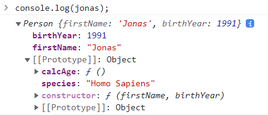
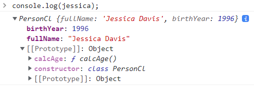
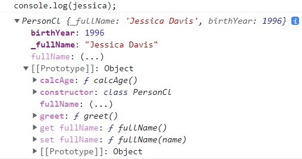
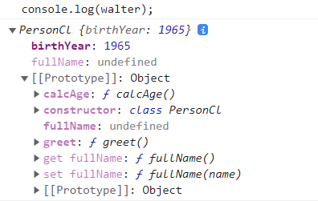
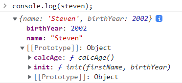

# ✔ '14-OOP' 이론 정리

## ▶ 206. What is Object-Oriented Programming?

### 🔹 Object-Oriented Programming (OOP)

- OOP는 objects의 개념을 기반으로한 프로그래밍 패러다임
- objects는 data (property)와 behavior (methods)를 포함하고 있음
- objects는 applications의 building block이고 다른 objects와 상호작용 함
- public interface (API)를 통해 상호작용이 일어남
- OOP는 code를 organize하고 유지보수하기 쉽게 하기 위해 만들어짐 (스파게티 코드를 피하기 위한 하나의 방법)
- classes와 instances (traditional OOP)
  - `class`: 새로운 objects를 생성할 수 있는 blueprint와 같음
  - `instance`: class로부터 만들어진 새로운 object

### 🔹 OOP의 4가지 원칙

1. Abstraction

   - 사용자가 신경 쓸 필요 없는 세부사항을 무시하거나 숨김
   - 실행하는데 있어서 필요한 부분만 알려줌

2. Encapsulation

   - class 내부에서 일부 properties나 methods를 private하게 유지함으로서, 외부 class가 접근하지 못하게 함
   - private하지 않은 properties나 methods는 public interface (API)로 노출됨
   - 외부 코드가 원치 않게 내부 properties를 변경하는 것을 막기 위함

3. Inheritance

   - 자식 class는 부모 class의 properties와 methods를 상속받아 사용할 수 있음

4. Polymorphism

   - 자식 class는 부모 class로부터 상속받은 methods를 overwrite할 수 있음

## ▶ 207. OOP in JavaScript

### 🔹 JS에서의 OOP - PROTOTYPES

1. Classical OOP 👉 `Classes`

   ```
   Class ---instantiation--→ Instance
   ```

   - Objects(instance)는 Class로부터 인스턴스화됨
   - 모든 instances는 Class로부터 behavior(methods)가 '복사'됨

2. JS에서의 OOP 👉 `Prototypes`

   ```
   Prototype ←--prototypal inheritance/delegation--- Object
   ```

   - Objects는 Prototype object에 '연결'됨
   - `prototypal inheritance`: prototype에 연결된 모든 objects는 prototype이 가지고 있는 behavior (methods)에 접근 가능함

### 🔹 JS에서 prototypal inheritance를 실행하는 3가지 방법

1. `Constructor functions`

   - 한 function으로부터 objects를 만드는 기술
   - Array, Map, Set과 같은 built-in objects가 실제로 실행되는 방법임

2. `ES6 Classes`

   - Constructor function 문법의 대안책 (Syntactic Sugar)
   - 사실 ES6 Classes는 constructor functions과 정확하게 작동하는 방식이 같음
   - 절대 classical OOP에서의 classes처럼 작동하는 것이 아님

3. `object.create()`

   - prototype object에 object를 연결시키는 가장 쉽고 직관적인 방법

## ▶ 208. Constructor Functions and the new Operator

- Constructor functions 이름은 대문자로 시작 (by convention)

  - function declaration, function expression으로 정의 가능
  - 단, arrow function으로는 정의 불가 (`this` 키워드 사용 불가하므로)

- `new` 키워드를 사용해 constructor function으로부터 새로운 objects를 만들 수 있음

- constructor function으로부터 object가 만들어지는 과정

  - 1. 새로운 empty object `{}`가 생성됨
  - 2. constructor function이 호출되고, `this` 키워드는 empty object `{}`를 가리키게 됨
  - 3. empty object `{}`는 prototype과 연결(linked)됨
  - 4. constructor function은 자동으로 object를 반환

  ```js
  const Person = function (firstName, birthYear) {
    // Instance properties
    this.firstName = firstName;
    this.birthYear = birthYear;
  };

  const jonas = new Person('Jonas', 1991);
  const matilda = new Person('Matilda', 2017);
  const jack = new Person('Jack', 1975);

  console.log(jonas);
  // Person {firstName: 'Jonas', birthYear: 1991}
  console.log(matilda);
  // Person {firstName: 'Matilda', birthYear: 2017}
  console.log(jack);
  // Person {firstName: 'Jack', birthYear: 1975}
  ```

- constructor function 내부에서 또 다른 함수를 사용해 methods를 만들진 말자

  - 이유: constructor function과 연결된 모든 objects에 methods가 새롭게 생성되기 때문
  - 해결책: constructor function의 `prototype property`을 이용해 methods를 생성하자

  ```js
  const Person = function (firstName, birthYear) {
    // 옳지 못한 코드!
    this.calcAge = function () {
      console.log(2037 - this.birthYear);
    };
  };
  ```

- `instanceof` 키워드를 사용해 특정 prototype와 연결된 object인지 알 수 있음

  ```js
  console.log(jonas instanceof Person); // true
  ```

## ▶ 209. Prototypes

- JS 내 모든 functions (constructor functions 포함)는 prototype property를 가지고 있음

  - `constructor명.prototype`: constructor functions에 연결(linked)된 모든 'objects의 prototype'을 의미
  - 주의) constructor function의 prototype이 아님!

  ```js
  console.log(Person.prototype); // {constructor: ƒ}
  ```

- prototype property를 이용해 property/methods를 만들면, 해당 prototype에 연결된 모든 objects는 이 property/methods를 자신이 포함하고 있진 않지만 접근은 가능

  ```js
  Person.prototype.calcAge = function () {
    console.log(2037 - this.birthYear);
  };

  Person.prototype.species = 'Homo Sapiens';
  ```

  ```js
  console.log(jonas);
  // Person {firstName: 'Jonas', birthYear: 1991}
  jonas.calcAge();
  // 46
  console.log(jonas.species);
  // Homo Sapiens
  ```

  

- objects의 `__proto__` 속성을 통해 해당 object가 연결된 prototype을 알 수 있음

  ```js
  console.log(jonas.__proto__); // {calcAge: ƒ, constructor: ƒ}
  console.log(jonas.__proto__ === Person.prototype); // true
  ```

- `prototypeObj.isPrototypeOf(객체명)`: 해당 object가 특정 prototype object에 연결된 객체인지 판단

  ```js
  console.log(Person.prototype.isPrototypeOf(jonas)); // true
  console.log(Person.prototype.isPrototypeOf(matilda)); // true
  console.log(Person.prototype.isPrototypeOf(Person)); // false
  ```

- `obj.hasOwnProperty(property명)`: 특정 object가 해당 property를 가지고 있는지 판단

  ```js
  console.log(jonas.hasOwnProperty('firstName')); // true
  console.log(jonas.hasOwnProperty('species')); // false
  ```

## ▶ 210. Prototypal Inheritance and The Prototype Chain

### 🔹 Prototypal Inheritance / Delegation 작동 방식

- Constructor function [Person()] --`.prototype`-→ Prototype [Person.prototype]
- Constructor function [Person()] ←-`.constructor`-- Prototype [Person.prototype]
- Prototype [Person.prototype] ←-`.__proto__`-- Object [jonas]

- `new` operator에 의한 object 생성 과정

  - 1. empty object가 새로 생성됨
  - 2. 호출한 constructor function의 `this` 키워드는 새로 생성된 empty object를 가리킴
  - 3. 새로운 object는 constructor function의 prototype property에 연결(linked)되어 `__proto__` 속성을 생성함
  - 4. 호출된 constructor function은 새로운 object를 반환함

- 'Constructor functions'과 'ES6 classes'는 위와 같은 방식으로 작동함
  - 단, `object.create()`은 위와 같은 방식으로 작동하지 않음

### 🔹 Prototype Chain

```
  null
   ↑
   | proto
   |
'Object.prototype' ← 'Object constructor'
   ↑
   | proto
   |
'Person.prototype' ← 'Person constructor'
   ↑
   | proto
   |
'jonas'
```

- prototype 또한 하나의 object이므로, 이 prototype object는 다른 prototype에 연결(linked)되어 있음

  - object는 연결된 prototypes의 모든 properties/methods를 상속(inheritance / delegation) 받아 사용 가능

- JS에는 'Object'라는 built-in constructor function이 있음

  - 모든 object의 Prototype Chain 최상단에는 `Object.prototype`이 존재
  - `Object.prototype`의 prototype = null

- `Prototype Chain`: prototypes에 의해 연결된 objects간 links

  - 특정 object에 해당 property/method가 없으면 Prototype Chain을 통해 상위 prototype로 거슬러 올라가 찾게 됨

## ▶ 211. Prototypal Inheritance on Built-In Objects

- 'objects'의 Prototypal Inheritance

  - 'jonas' → 'Person.prototype' → 'Object.prototype' → null

  ```js
  console.log(jonas.__proto__);
  // {species: 'Homo Sapiens', calcAge: ƒ, constructor: ƒ}
  console.log(jonas.__proto__.__proto__);
  // {constructor: ƒ Object(), … (Object의 properties/methods)}
  console.log(jonas.__proto__.__proto__.__proto__);
  // null
  ```

  ```js
  console.dir(Person.prototype.constructor);
  // ƒ Person(firstName, birthYear)
  ```

- 'arrays'의 Prototypal Inheritance

  - 'arr' → 'Array.prototype' → 'Object.prototype' → null
  - Array.prototype에 직접 methods를 생성하여 상속받아 사용할 수 있으나, 공동 작업하는 다른 개발자들에게 혼란을 줄 수 있기 때문에 좋지 못한 방법임

  ```js
  const arr = [3, 6, 6, 5, 6, 9, 9]; // new Array === []

  console.log(arr.__proto__);
  // [constructor: ƒ Array(), … (Array의 properties/methods)]
  console.log(arr.__proto__.__proto__);
  // {constructor: ƒ Object(), … (Object의 properties/methods)}
  ```

  ```js
  console.log(arr.__proto__ === Array.prototype); // true
  ```

  ```js
  // 선호되지 않은 방식!
  Array.prototype.unique = function () {
    return [...new Set(this)];
  };

  console.log(arr.unique()); // [3, 6, 5, 9]
  ```

- 'DOM objects'의 Prototypal Inheritance

  - 'h1' → 'HTMLHeadingElement.prototype' → 'HTMLElement.prototype' → 'Element.prototype' → 'Node.prototype' → 'EventTarget.prototype' → 'Object.prototype' → null

  ```js
  const h1 = document.querySelector('h1');

  console.log(h1.__proto__);
  // {constructor: ƒ HTMLHeadingElement(), … (HTMLHeadingElement의 properties/methods)}
  console.log(h1.__proto__.__proto__);
  // {constructor: ƒ HTMLElement(), … (HTMLElement의 properties/methods)}
  console.log(h1.__proto__.__proto__.__proto__);
  // {constructor: ƒ Element(), … (Element의 properties/methods)}
  console.log(h1.__proto__.__proto__.__proto__.__proto__);
  // {constructor: ƒ Node(), … (Node의 properties/methods)}
  console.log(h1.__proto__.__proto__.__proto__.__proto__.__proto__);
  // {constructor: ƒ EventTarget(), … (EventTarget의 properties/methods)}
  console.log(h1.__proto__.__proto__.__proto__.__proto__.__proto__.__proto__);
  // {constructor: ƒ Object(), … (Object의 properties/methods)}
  ```

- 'function'의 Prototypal Inheritance

  - 'func' → 'Function.prototype' → 'Object.prototype' → null

  ```js
  const func = x => x + 1;

  console.log(func.__proto__);
  // {constructor: ƒ Function(), … (function의 properties/methods)}
  console.log(func.__proto__.__proto__);
  // {constructor: ƒ Object(), … (Object의 properties/methods)}
  ```

## ▶ 213. ES6 Classes

- JS에서 classes는 사실 특별한 function 종류와 같음

  - 따라서, class도 function처럼 Class expression, Class declaration 두 방식으로 정의 가능

  ```js
  // Class expression
  const PersonCl = class {...}
  ```

  ```js
  // Class declaration
  class PersonCl {...}
  ```

- JS에서 ES6 Classes는 classical OOP에서의 classes와 달리, constructor functions의 작동 방식과 동일하게 작동됨

  - class 내부에 constructor method는 constructor function과 같은 기능을 함
  - class 내부에 정의한 methods(constructor 바깥에 정의된 methods)는 constructor의 prototype property에 생성됨
  - `new` 키워드를 사용해 해당 class를 호출하면 constructor function을 사용했을 때와 동일하게 objects (instances)를 생성하게 됨

  ```js
  class PersonCl {
    constructor(fullName, birthYear) {
      this.fullName = fullName;
      this.birthYear = birthYear;
    }

    // Instance methods
    calcAge() {
      console.log(2037 - this.birthYear);
    }
  }
  ```

  ```js
  const jessica = new PersonCl('Jessica Davis', 1996);

  console.log(jessica);
  // PersonCl {fullName: 'Jessica Davis', birthYear: 1996}
  jessica.calcAge();
  // 41
  ```

  

- 'jessica object'의 Prototypal Inheritance

  - 'jessica' → 'PersonCl.prototype' → 'Object.prototype' → null

  ```js
  console.log(jessica.__proto__);
  // {constructor: ƒ class PersonCl, calcAge: ƒ}
  console.log(jessica.__proto__.__proto__);
  // {constructor: ƒ Object(), … (Object의 properties/methods)}
  ```

  ```js
  console.log(jessica.__proto__ === PersonCl.prototype); // true
  ```

- prototype property를 이용해 직접 method 정의 가능

  ```js
  PersonCl.prototype.greet = function () {
    console.log(`Hey ${this.fullName}`);
  };

  jessica.greet(); // Hey Jessica Davis
  ```

- class의 특징
  - 1. class declaration으로 정의한 경우에도, class는 hoisted 되지 않는다
  - 2. class는 first-class citizens으로, function의 인자로 들어갈 수도 있고 function의 반환값으로 사용될 수 있다
  - 3. class는 strict mode에서 실행된다

## ▶ 214. Setters and Getters

- Setter와 Getter methods는 accessor property로, 함수의 값을 획득(get)하고 설정(set)하는 역할을 담당

- 함수명 앞에 `get`, `set` 키워드를 붙여 method처럼 표현하지만, 외부 코드에서는 일반적인 property처럼 사용함

  - getter method는 'obj.propName'을 사용해 property를 읽으려고 할 때 실행됨
  - setter method는 'obj.propName = value'을 사용해 property에 값을 할당하려 할 때 실행됨

- 'object'에서의 Setter/Getter method

  ```js
  const account = {
    owner: 'Jonas',
    movements: [200, 530, 120, 300],

    get latest() {
      return this.movements.slice(-1).pop();
    },

    set latest(mov) {
      this.movements.push(mov);
    },
  };
  ```

  ```js
  // getter method 실행
  console.log(account.latest); // 300
  ```

  ```js
  // setter method 실행
  account.latest = 50;
  console.log(account.movements); // [200, 530, 120, 300, 50]
  ```

- 'class'에서의 Setter/Getter method

  - argument validation을 위해 Setter/Getter method를 사용하기도 함
  - Setter method을 통해 설정하려고 하는 property가 이미 존재하면 새로운 property명을 생성해 할당해준 후, getter method를 사용해 새롭게 생성한 property명을 반환해주면 됨

  ```js
  class PersonCl {
   constructor(fullName, birthYear) {
      this.fullName = fullName;
      this.birthYear = birthYear;
    }

   ...

   // Set a property that already exists
   set fullName(name) {
      if (name.includes(' ')) this._fullName = name;
      else alert(`${name} is not a full name!`);
   }

   get fullName() {
      return this._fullName;
   }
  }
  ```

  ```js
  const jessica = new PersonCl('Jessica Davis', 1996);

  console.log(jessica);
  // PersonCl {_fullName: 'Jessica Davis', birthYear: 1996}
  ```

  

  ```js
  const walter = new PersonCl('Walter', 1965);

  console.log(walter);
  // 일단, 'Walter is not a full name!'이라는 내용을 담은 경고창이 뜸
  // PersonCl {birthYear: 1965}
  ```

  

## ▶ 215. Static Methods

- Static methods는 constructor function 자체에 추가되는 method

  - prototype property에 추가되는 method가 아니므로, objects (instances)로 상속되지 않음
  - 즉, objects (instances)에서는 static methods를 사용할 수 없음
  - Static methods 예) `Array.from()`, `Number.parseInt()`

- 'constructor function'에 Static methods 추가하기

  ```js
  const Person = function (firstName, birthYear) {
    // Instance properties
    this.firstName = firstName;
    this.birthYear = birthYear;
  };

  // Static method 생성
  Person.hey = function () {
    console.log('Hey there 👋');
    console.dir(this);
  };
  ```

  ```js
  const jonas = new Person('Jonas', 1991);

  Person.hey();
  // Hey there 👋
  // ƒ Person(firstName, birthYear)
  jonas.hey();
  // Uncaught TypeError: jonas.hey is not a function
  ```

- 'class'에 Static methods 추가하기

  - Instance methods: prototype property에 추가되는 method
  - Static methods: constructor 자체에 추가되는 method
  - static method명 앞에 `static` 키워드를 붙여 정의 가능

  ```js
  class PersonCl {
   // Instance methods
   ...

   // Static method
   static hey() {
      console.log('Hey there 👋');
      console.dir(this);
   }
  }
  ```

  ```js
  PersonCl.hey();
  // Hey there 👋
  // class PersonCl
  ```

## ▶ 216. Object.create

- constructor functions, ES6 classes 이외의 prototype inheritance/delegation을 실행시키는 또다른 방법임

  - `Object.create()`는 constructor function, prototype property와는 아무런 관련이 없음

- `Object.create(proto[, propertiesObject])`

  - 지정된 prototype object와 연결된(linked) 새로운 empty object를 반환
  - `proto`: 새로 만든 object의 prototype object

  ```js
  // prototype object 생성
  const PersonProto = {
    calcAge() {
      console.log(2037 - this.birthYear);
    },

    init(firstName, birthYear) {
      this.firstName = firstName;
      this.birthYear = birthYear;
    },
  };
  ```

  ```js
  // 새로운 object 생성 1
  const steven = Object.create(PersonProto);

  steven.name = 'Steven';
  steven.birthYear = 2002;

  console.log(steven); // {name: 'Steven', birthYear: 2002}
  steven.calcAge(); // 35
  ```

  ```js
  // 새로운 object 생성 2
  const sarah = Object.create(PersonProto);

  sarah.init('Sarah', 1979);

  console.log(sarah); // {firstName: 'Sarah', birthYear: 1979}
  sarah.calcAge(); // 58
  ```

  

- 'steven object'의 Prototypal Inheritance

  - 'steven' → 'PersonProto object' → 'Object.prototype' → null

  ```js
  console.log(steven.__proto__);
  // {calcAge: ƒ, init: ƒ}
  console.log(steven.__proto__.__proto__);
  // {constructor: ƒ Object(), … (Object의 properties/methods)}
  ```

  ```js
  console.log(steven.__proto__ === PersonProto); // true
  ```

## ▶ 218. Inheritance Between "Classes": Constructor Functions

- 이해를 돕기 위해 constructor function이랑 prototype property를 합쳐 편히 'class'라고 부르기로 하자
- 두 classes를 연결(linked)시켜 child class가 parent class의 methods를 상속받게 하는 방법 (3가지)

  - 1. Constructor functions
  - 2. ES6 Classes
  - 3. Object.create()

- Constructor Functions을 사용해 'Student' class (child)와 'Person' class (parent)를 연결시키자

  ```
  'Object.prototype' ← 'Object constructor'
     ↑
     | proto
     |
  'Person.prototype' ← 'Person constructor'
     ↑
     | proto
     |
  'Student.prototype' ← 'Student constructor'
     ↑
     | proto
     |
  'mike'
  ```

- Person constructor function의 properties를 Student constructor function로 상속받기 위해 `call()` method를 사용하자

  - Person 내부의 `this` 키워드를 Student를 호출한 object(Student 내 `this`)로 값 설정

- `Object.create()` method를 사용해 'Student' prototype을 'Person' prototype에 연결

  - `Object.create()`는 prototype object와 연결된(linked) 새로운 empty object를 반환하므로, 반드시 'Student' prototype에 methods를 추가하기 전에 먼저 연결시켜야 함

  ```js
  // Person class
  const Person = function (firstName, birthYear) {
    this.firstName = firstName;
    this.birthYear = birthYear;
  };

  Person.prototype.calcAge = function () {
    console.log(2037 - this.birthYear);
  };
  ```

  ```js
  // Student class
  const Student = function (firstName, birthYear, course) {
    Person.call(this, firstName, birthYear);
    this.course = course;
  };

  Student.prototype = Object.create(Person.prototype); // Linking prototypes

  Student.prototype.introduce = function () {
    console.log(`My name is ${this.firstName} and I study ${this.course}`);
  };
  ```

  ```js
  const mike = new Student('Mike', 2020, 'Computer Science');

  mike.introduce(); // My name is Mike and I study Computer Science
  mike.calcAge(); // 17
  ```

- 'mike'의 Prototypal Inheritance

  - 'mike' → 'Student.prototype' → 'Person.prototype' → 'Object.prototype' → null

  ```js
  console.log(mike.__proto__); // {introduce: ƒ}
  console.log(mike.__proto__.__proto__); // {calcAge: ƒ, constructor: ƒ}
  ```

  ```js
  console.log(mike instanceof Student); // true
  console.log(mike instanceof Person); // true
  console.log(mike instanceof Object); // true
  ```

  ```js
  Student.prototype.constructor = Student;

  console.dir(Student.prototype.constructor);
  // ƒ Student(firstName, birthYear, course)
  ```

## ▶ 220. Inheritance Between "Classes": ES6 Classes

- `extends` 키워드를 사용해 또다른 class의 child class를 생성할 수 있음

  ```js
  class ChildClass extends ParentClass {
    /* … */
  }
  ```

- child class에서 constructor 함수를 직접 생성하는 경우, `super()` 함수를 사용해 parent object의 함수를 호출할 수 있음

  - 주의) child class의 constructor 함수에서 `this` 키워드를 사용해 properties를 생성할 경우, `super()` 함수를 먼저 호출한 이후에 `this` 사용해야함

  ```js
  super([arguments]); // parent의 constructor 함수를 호출
  super.parent함수명([arguments]); // parent의 methods를 호출
  ```

- child class에서 constructor 함수를 직접 생성하지 않은 경우에는, 자동으로 parent class의 constructor 함수를 상속받아 만들어짐

  - 이때, parent class의 constructor 함수에 arguments가 모두 전달됨

  ```js
  class ChildClass extends ParentClass {
    // 아래처럼 자동으로 parent의 constructor를 호출하게 됨
    constructor(...args) {
      super(...args);
    }
  }
  ```

- ES6 Classes를 사용해 'Student' class (child)와 'Person' class (parent)를 연결시키자

  ```js
  // Parent class
  class PersonCl {
    constructor(fullName, birthYear) {
      this.fullName = fullName;
      this.birthYear = birthYear;
    }

    calcAge() {
      console.log(2037 - this.birthYear);
    }
    ...
  }
  ```

  ```js
  // Child class
  class StudentCl extends PersonCl {
    constructor(fullName, birthYear, course) {
      super(fullName, birthYear); // Always needs to happen first!
      this.course = course;
    }

    introduce() {
      console.log(`My name is ${this.fullName} and I study ${this.course}`);
    }

    // method override
    calcAge() {
      console.log(
        `I'm ${
          2037 - this.birthYear
        } years old, but as a student I feel more like ${
          2037 - this.birthYear + 10
        }`
      );
    }
  }
  ```

  ```js
  const martha = new StudentCl('Martha Jones', 2012, 'Computer Science');

  martha.introduce();
  // My name is Martha Jones and I study Computer Science
  martha.calcAge();
  // I'm 25 years old, but as a student I feel more like 35
  ```

## ▶ 221. Inheritance Between "Classes": Object.create

- `Object.create()`를 사용해 'Student' object (child)와 'Person' object (parent)를 연결시키자

  ```js
  // Parent object
  const PersonProto = {
    calcAge() {
      console.log(2037 - this.birthYear);
    },

    init(firstName, birthYear) {
      this.firstName = firstName;
      this.birthYear = birthYear;
    },
  };
  ```

  ```js
  // Child object
  const StudentProto = Object.create(PersonProto);

  StudentProto.init = function (firstName, birthYear, course) {
    PersonProto.init.call(this, firstName, birthYear);
    this.course = course;
  };

  StudentProto.introduce = function () {
    console.log(`My name is ${this.firstName} and I study ${this.course}`);
  };
  ```

  ```js
  const jay = Object.create(StudentProto);

  jay.init('Jay', 2010, 'Computer Science');

  jay.introduce();
  // My name is Jay and I study Computer Science
  jay.calcAge();
  // 27
  ```

## ▶ 222. Another Class Example

- ES6 class를 사용해 'bankist' app의 일부 기능을 구현해보자

  - 아래 코드에서의 단점: 외부에서 'acc1'의 pin, movements에 접근 및 설정이 가능하고, Account 내부에서만 사용되는 approveLoan() method에도 접근이 가능함
  - data privacy와 data encapsulation이 필요함

  ```js
  class Account {
    constructor(owner, currency, pin) {
      this.owner = owner;
      this.currency = currency;
      this.pin = pin;
      this.movements = [];
      this.locale = navigator.language;

      console.log(`Thanks for opening an account, ${owner}`);
    }

    // Public interface (API)
    deposit(val) {
      this.movements.push(val);
    }

    withdraw(val) {
      this.deposit(-val);
    }

    approveLoan(val) {
      return true;
    }

    requestLoan(val) {
      if (this.approveLoan(val)) {
        this.deposit(val);
        console.log(`Loan approved`);
      }
    }
  }
  ```

  ```js
  const acc1 = new Account('Jonas', 'EUR', 1111);
  // Thanks for opening an account, Jonas

  acc1.deposit(250);
  acc1.withdraw(140);
  acc1.requestLoan(1000);
  // Loan approved

  console.log(acc1);
  // Account {owner: 'Jonas', currency: 'EUR', pin: 1111, movements: Array(3), locale: 'ko-KR'}
  ```

## ▶ 223. Encapsulation: Protected Properties and Methods

- 변수명 앞에 `_` (underscore)를 사용해 외부에서 접근하면 안되는 properties/methods임을 간접적으로 알릴 수 있음 (just convention)

  - fake encapsulation, fake privacy
  - 주의) 변수명 앞에 `_`을 추가했다고 해당 properties/methods에 접근이 불가한 것이 절대 아님 (기능 없음)
  - 직접 접근/설정하는 것을 막는 대신, 아래 `getMovements()`처럼 methods를 사용해 접근을 가능하게 할 수도 있음

  ```js
  class Account {
    constructor(owner, currency, pin) {
      this.owner = owner;
      this.currency = currency;
      this._pin = pin;
      this._movements = [];
      this.locale = navigator.language;

      console.log(`Thanks for opening an account, ${owner}`);
    }

    ...

    getMovements() {
      return this._movements;
    }

    _approveLoan(val) {
      return true;
    }

    requestLoan(val) {
      if (this._approveLoan(val)) {
        this.deposit(val);
        console.log(`Loan approved`);
      }
    }
  }
  ```

## 🔹 224. Encapsulation: Private Class Fields and Methods

- Class Fields는 아직 실험 단계에 있어, 이를 지원하는 브라우저가 제한적임

- Class Fields 종류 (8가지)
  - 1. Public instance fields
  - 2. Public static fields
  - 3. Public instance methods
  - 4. Public static methods
  - 5. Private instance fields
  - 6. Private static fields
  - 7. Private instance methods
  - 8. Private static methods

1. Public instance fields

   - 해당 class의 모든 instance에 존재하게 됨
   - constructor 함수 안에서 선언하는 것과 비슷
     - 단, constructor 함수 안에서 생성한 properties는 특정 인자 값으로 할당됨

2. Private instance fields

   - `#names` 형태로 선언되어, 외부에서 접근하려고 하면 syntax error가 발생하게 됨

3. Public instance methods

   - 해당 class의 모든 instance에서 접근 가능한 methods

4. Private instance methods

   - `#names` 형태로 선언되어, 외부에서 접근하려고 하면 syntax error가 발생하게 됨

   ```js
   class Account {
     // 1) Public fields (instances)
     locale = navigator.language;

     // 2) Private fields (instances)
     #movements = [];
     #pin;

     constructor(owner, currency, pin) {
       this.owner = owner;
       this.currency = currency;
       this.#pin = pin;
     }

     // 3) Public methods
     getMovements() {...}

     deposit(val) {...}

     withdraw(val) {...}

     requestLoan(val) {
       if (this.#approveLoan(val)) {
         this.deposit(val);
         console.log(`Loan approved`);
         return this;
       }
     }

     // 4) Private methods
     #approveLoan(val) {
       return true;
     }
   }
   ```

## 🔹 225. Chaining Methods

- instance methods를 chaining해서 사용해보자

  - 단, instance methods가 각각 instance를 반환해줘야 함

  ```js
  class Account {
    ...
    deposit(val) {
      this.#movements.push(val);
      return this;
    }

    withdraw(val) {
      this.deposit(-val);
      return this;
    }

    requestLoan(val) {
      if (this.#approveLoan(val)) {
        this.deposit(val);
        console.log(`Loan approved`);
        return this;
      }
    }
  }
  ```

  ```js
  const acc1 = new Account('Jonas', 'EUR', 1111);

  acc1.deposit(300).deposit(500).withdraw(35).requestLoan(25000).withdraw(4000);
  // Loan approved
  console.log(acc1.getMovements());
  // [300, 500, -35, 25000, -4000]
  ```
