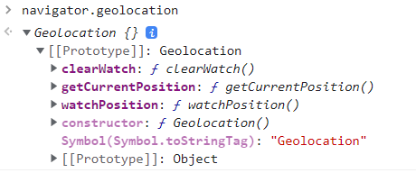
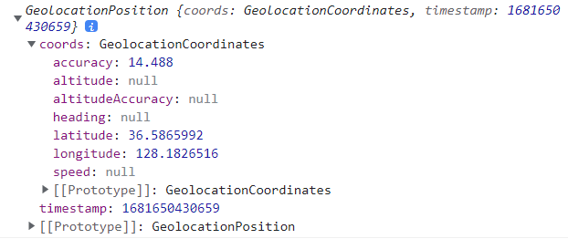
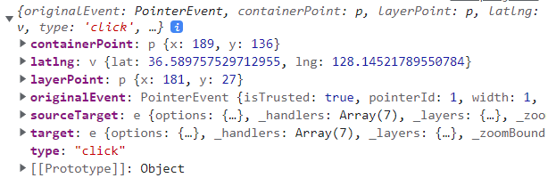
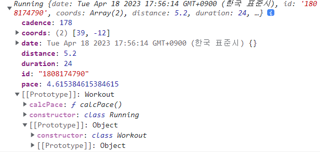
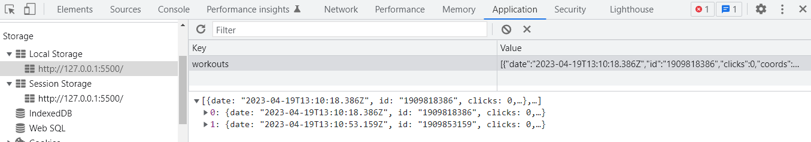

# ✔ '15-Mapty' 이론 정리

## ▶ 230. Project Overview

- `Mapty Project`에 대한 설명

  - 지도에서 한 위치를 클릭하면, workout form이 나타남
  - 자신의 활동을 기입하면 사이드 바에 박스 형태로 활동이 뜨게 되고, 지도에선 클릭한 위치에 pin과 popup 박스가 나타나게 됨
  - 사이드 바에 기록된 각 박스를 클릭하면 지도에서 해당 위치로 이동하게 됨
  - 창을 닫아도 기록은 지워지지 않고 유지되는 것을 확인할 수 있음

## ▶ 231. How to Plan a Web Project

- Web project에 대한 계획을 짜는 방법 (아래 1 ~ 4번까지 Planning Step)
  - 1. User Stories
  - 2. Features
  - 3. FlowChart
  - 4. Architecture
  - 5. Development Step

### 🔹 User Stories

- 사용자 관점에서 application의 기능을 설명하는 단계
- user stories를 모두 합쳐 하나의 전체 application을 나타낼 수 있음
- User Story의 Common Format: As a `type of user`, I want `an action` so that `a benefit`

  - `어떤 user`(일반 사용자, admin 등)로서
  - `어떤 행동`을 통해
  - `어떤 결과`를 얻고 싶은지

- 'Mapty Project'에 대한 User Stories

  - 1. 일반 사용자로서, location/distance/time/steps per minute을 포함한 'running' workout을 기록하여, 나의 running 기록들을 유지하고 싶음
  - 2. 일반 사용자로서, location/distance/time/elevation gain을 포함한 'cycling' workout을 기록하여, 나의 cycling 기록들을 유지하고 싶음
  - 3. 일반 사용자로서, '기록장'에 그동안 기록한 모든 workouts를 볼 수 있게 하여, 나의 성장을 한눈에 볼 수 있었으면 좋겠음
  - 4. 일반 사용자로서, '지도'에 그동안 기록한 모든 workouts를 볼 수 있게 하여, 쉽게 확인할 수 있었으면 좋겠음
  - 5. 일반 사용자로서, 내가 app을 떠나 다시 돌아올 때도 그동안 기록한 모든 workouts를 볼 수 있게 하여, 시간이 흘러도 기록들을 유지했으면 좋겠음

### 🔹 Features

- User Stories를 바탕으로 실제 기능을 구체화하기
- 'Mapty Project'에 대한 Features

  - User Story 1) 사용자가 지도를 클릭하면 새로운 workout를 추가할 수 있음
  - User Story 1) 사용자의 현재 geolocation에 따라 보여지는 지도 위치를 맞추기
  - User Story 1) location/distance/time/steps per minute을 입력할 form
  - User Story 2) location/distance/time/elevation gain을 입력할 form
  - User Story 3) 모든 workouts을 담은 list를 화면에 나타내기
  - User Story 4) 모든 workouts을 기록한 map을 화면에 나타내기
  - User Story 5) local storage API를 사용해 브라우저에 workout data를 저장하기
  - User Story 5) 페이지 로딩 후, local storage에 저장된 workout data를 읽어 화면에 나타내기

### 🔹 FlowChart

- Features를 바탕으로 기능들을 연결하기 (WHAT we will build)

  - 노란색: event, 빨간색: async, 초록색: render, 파란색: local storage API

  

### 🔹 Architecture

- function, class 등 어떻게 구조화하여 기능들을 구현할 건지 결정 (HOW we will build it)

  

## ▶ 232. Using the Geolocation API

- Geolocation API는 browser API로, 사용자의 위치정보를 가져올 수 있음

  - privacy의 이유로, 사용자로부터 위치 정보 제공 허가 요청을 받아야 가져올 수 있음

- Geolocation API는 `navigator.geolocation`의 호출에 의해 접근이 가능

  - `navigator.geolocation`은 Geolocation object을 반환

  

- `Geolocation.getCurrentPosition(success, error)`

  - device의 현재 위치 정보를 가져옴
  - `success`: 현재 위치 정보를 가져오는 것을 성공했을 때 실행되는 callback function
  - `error`: 현재 위치 정보를 가져오는 것을 실패했을 때 실행되는 callback function

  ```js
  if (navigator.geolocation)
    navigator.geolocation.getCurrentPosition(
      function (position) {
        console.log(position);
        // GeolocationPosition {coords: GeolocationCoordinates, timestamp: 1681650430659}

        const { latitude, longitude } = position.coords;
        console.log(`https://www.google.co.kr/maps/@${latitude},${longitude}`);
      },
      function () {
        alert('Could not get your position');
      }
    );
  ```

  

## ▶ 233. Displaying a Map Using Leaflet Library

- `Leaflet`: mobile-friendly interactive map을 위한 오픈소스 JS 라이브러리

  - <https://leafletjs.com/>
  - `setView(geographical coordinates, zoom level)`

  ```js
  navigator.geolocation.getCurrentPosition(
    function (position) {
      ...
      const coords = [latitude, longitude];
      const map = L.map('map').setView(coords, 13);

      L.tileLayer('https://tile.openstreetmap.org/{z}/{x}/{y}.png', {
          attribution: '&copy; <a href="https://www.openstreetmap.org/copyright">OpenStreetMap</a> contributors'
      }).addTo(map);

      L.marker(coords).addTo(map)
          .bindPopup('A pretty CSS3 popup.<br> Easily customizable.')
          .openPopup();
    },
    ...
  );
  ```

## ▶ 234. Displaying a Map Marker

- 지도 상의 한 지점을 클릭했을 때, 해당 위치에 marker와 popup을 띄워보자

  - `map.on(event type, callback)`
  - `.bindPopup(<String|HTMLElement|Function|Popup>, <Popup options>)`
  - `L.popup(<Popup options> options, <Layer> source)`: Popup object 생성
  - `.setPopupContent(<String|HTMLElement|Popup>)`

  ```js
  navigator.geolocation.getCurrentPosition(
    function (position) {
      ...
      map.on('click', function(mapEvent) {
        console.log(mapEvent);
        // {originalEvent: PointerEvent, containerPoint: p, layerPoint: p, latlng: v, type: 'click', …}

        const {lat, lng} = mapEvent.latlng;

        L.marker([lat, lng])
          .addTo(map)
          .bindPopup(
            L.popup({
              maxWidth: 250,
              minWidth: 100,
              autoClose: false,
              closeOnClick: false,
              className: `running-popup`,
            })
          )
          .setPopupContent('workout')
          .openPopup();
      });
    },
    ...
  );
  ```

  

## ▶ 235. Rendering Workout Input Form

- 지도에서 한 지점을 클릭했을 때, 'input form'이 뜨게 한 후 submit되면 지도 상에 marker와 popup을 띄우게 하자

  ```js
  let map, mapEvent;

  if (navigator.geolocation)
    navigator.geolocation.getCurrentPosition(
      function (position) {
        ...
        map = L.map('map').setView(coords, 13);
        ...

        map.on('click', function(mapE) {
          mapEvent = mapE;
          form.classList.remove('hidden');
          inputDistance.focus();
        });
      },
      ...
    );

  form.addEventListener('submit', function(e) {
    e.preventDefault();

    // Clear input fields
    inputDistance.value = inputDuration.value = inputCadence.value = inputElevation.value =
      '';

    // Display marker
    const {lat, lng} = mapEvent.latlng;
    L.marker([lat, lng])
      .addTo(map)
      .bindPopup(
        L.popup({
          maxWidth: 250,
          minWidth: 100,
          autoClose: false,
          closeOnClick: false,
          className: `running-popup`,
        })
      )
      .setPopupContent('workout')
      .openPopup();
  });
  ```

- '.form\_\_input--type' select 태그의 선택값이 변하면, 선택한 입력란을 화면에 나타내자

  ```js
  inputType.addEventListener('change', function () {
    inputElevation.closest('.form__row').classList.toggle('form__row--hidden');
    inputCadence.closest('.form__row').classList.toggle('form__row--hidden');
  });
  ```

## ▶ 236. Project Architecture

- Mapty project의 architecture를 간략하게 그려보자

  - 'App' class, 'Workout' class
  - 'Workout' class > 'Running' class, 'Cycling' class

  

## ▶ 237. Refactoring for Project Architecture

- 위 architecture에 따라 기존 코드를 리팩토링해 App class를 만들어보자

  - 주의) `.getCurrentPosition()` method에서 첫 번째인자로 들어가는 `_loadMap` function은 getCurrentPosition function에 의해 호출이 되기 때문에, \_loadMap function 내 this 키워드는 'undefined'를 가리키게 됨
  - 주의) `this.#map.on()` 에서 event handler인 `_showForm` function 내 this 키워드는 'this.#map'을 가리키게 됨
  - 주의) `form.addEventListener()` 에서 event handler인 `_newWorkout` function 내 this 키워드는 'form element'를 가리키게 됨
  - 해결책: `bind()` method를 사용해 this 키워드가 app object를 가리키게 함으로써 위 모든 problems을 해결할 수 있음

  ```js
  class App {
    #map;
    #mapEvent;

    constructor() {
      // Get user's position
      this._getPosition();

      // Attach event handlers
      form.addEventListener('submit', this._newWorkout.bind(this));
      inputType.addEventListener('change', this._toggleElevationField);
    }

    _getPosition() {
      if (navigator.geolocation)
        navigator.geolocation.getCurrentPosition(
          this._loadMap.bind(this),
          function () {
            alert('Could not get your position');
          }
        );
    }

    _loadMap(position) {
      const { latitude, longitude } = position.coords;

      const coords = [latitude, longitude];

      this.#map = L.map('map').setView(coords, 13);

      L.tileLayer('https://{s}.tile.openstreetmap.fr/hot/{z}/{x}/{y}.png', {
        attribution:
          '&copy; <a href="https://www.openstreetmap.org/copyright">OpenStreetMap</a> contributors',
      }).addTo(this.#map);

      // Handling clicks on map
      this.#map.on('click', this._showForm.bind(this));
    }

    _showForm(mapE) {
      this.#mapEvent = mapE;
      form.classList.remove('hidden');
      inputDistance.focus();
    }

    _toggleElevationField() {
      inputElevation
        .closest('.form__row')
        .classList.toggle('form__row--hidden');
      inputCadence.closest('.form__row').classList.toggle('form__row--hidden');
    }

    _newWorkout(e) {
      e.preventDefault();

      // Clear input fields
      inputDistance.value =
        inputDuration.value =
        inputCadence.value =
        inputElevation.value =
          '';

      // Display marker
      const { lat, lng } = this.#mapEvent.latlng;
      L.marker([lat, lng])
        .addTo(this.#map)
        .bindPopup(
          L.popup({
            maxWidth: 250,
            minWidth: 100,
            autoClose: false,
            closeOnClick: false,
            className: `running-popup`,
          })
        )
        .setPopupContent('workout')
        .openPopup();
    }
  }

  const app = new App();
  ```

## ▶ 238. Managing Workout Data: Creating Classes

- 위 architecture에 따라 Workout class, Running class, Cycling class를 만들어보자

  ```js
  class Workout {
    date = new Date();
    id = (Date.now() + '').slice(-10);

    constructor(coords, distance, duration) {
      this.coords = coords; // [lat, lng]
      this.distance = distance; // in km
      this.duration = duration; // in min
    }
  }
  ```

  ```js
  class Running extends Workout {
    constructor(coords, distance, duration, cadence) {
      super(coords, distance, duration);
      this.cadence = cadence;
      this.calcPace();
    }

    calcPace() {
      // min/km
      this.pace = this.duration / this.distance;
      return this.pace;
    }
  }
  ```

  ```js
  class Cycling extends Workout {
    constructor(coords, distance, duration, elevationGain) {
      super(coords, distance, duration);
      this.elevationGain = elevationGain;
      this.calcSpeed();
    }

    calcSpeed() {
      // km/h
      this.speed = this.distance / (this.duration / 60);
      return this.speed;
    }
  }
  ```

  ```js
  const run1 = new Running([39, -12], 5.2, 24, 178);
  const cycling1 = new Cycling([39, -12], 27, 95, 523);

  console.log(run1);
  // Running {date: Tue Apr 18 2023 17:56:14 GMT+0900 (한국 표준시), id: '1808174790', coords: Array(2), distance: 5.2, duration: 24, …}
  console.log(cycling1);
  // Cycling {date: Tue Apr 18 2023 17:56:14 GMT+0900 (한국 표준시), id: '1808174791', coords: Array(2), distance: 27, duration: 95, …}
  ```

  

## ▶ 239. Creating a New Workout

- `_newWorkout` function을 수정해보자

  ```js
  class App {
    ...
    #workouts = [];

    ...
    _newWorkout(e) {
      const validInputs = (...inputs) =>
        inputs.every(inp => Number.isFinite(inp));
      const allPositive = (...inputs) => inputs.every(inp => inp > 0);

      e.preventDefault();

      // Clear input fields
      inputDistance.value =
        inputDuration.value =
        inputCadence.value =
        inputElevation.value =
          '';

      // Get data from form
      const type = inputType.value;
      const distance = +inputDistance.value;
      const duration = +inputDuration.value;
      const { lat, lng } = this.#mapEvent.latlng;
      let workout;

      // If workout running, create running object
      if (type === 'running') {
        const cadence = +inputCadence.value;

        // Check if data is valid
        if (
          !validInputs(distance, duration, cadence) ||
          !allPositive(distance, duration, cadence)
        )
          return alert('Inputs have to be positive numbers!');

        workout = new Running([lat, lng], distance, duration, cadence);
      }

      // If workout cycling, create cycling object
      if (type === 'cycling') {
        const elevation = +inputElevation.value;

        // Check if data is valid
        if (
          !validInputs(distance, duration, elevation) ||
          !allPositive(distance, duration)
        )
          return alert('Inputs have to be positive numbers!');

        workout = new Cycling([lat, lng], distance, duration, elevation);
      }

      // Add new object to workout array
      this.#workouts.push(workout);

      // Render workout on map as marker
      this._renderWorkoutMarker(workout);
    }

    _renderWorkoutMarker(workout) {
      L.marker(workout.coords)
        .addTo(this.#map)
        .bindPopup(
          L.popup({
            maxWidth: 250,
            minWidth: 100,
            autoClose: false,
            closeOnClick: false,
            className: `${workout.type}-popup`,
          })
        )
        .setPopupContent('workout')
        .openPopup();
    }
  }
  ```

## ▶ 240. Rendering Workouts

- side bar에 workout list를 render하는 `_renderWorkout()` 함수를 만들어보자

- input form을 화면에서 보이지 않게 하는 `_hideForm()` 함수를 만들어보자

  - 이때, form이 사라질 때 transition 스타일 효과가 적용되는 것을 막기 위해 display = 'none'을 먼저 적용한 후 hidden 클래스를 추가해줌

  ```js
  class App {
    ...

    _hideForm() {
      // Empty inputs
      inputDistance.value = inputDuration.value = inputCadence.value = inputElevation.value =
        '';

      form.style.display = 'none';
      form.classList.add('hidden');
      setTimeout(() => (form.style.display = 'grid'), 1000);
    }

    _newWorkout(e) {
      ...
      // Render workout on list
      this._renderWorkout(workout);

      // Hide form + clear input fields
      this._hideForm();
    }

    _renderWorkout(workout) {
      let html = `
        <li class="workout workout--${workout.type}" data-id="${workout.id}">
          <h2 class="workout__title">${workout.description}</h2>
          <div class="workout__details">
            <span class="workout__icon">${
              workout.type === 'running' ? '🏃‍♂️' : '🚴‍♀️'
            }</span>
            <span class="workout__value">${workout.distance}</span>
            <span class="workout__unit">km</span>
          </div>
          <div class="workout__details">
            <span class="workout__icon">⏱</span>
            <span class="workout__value">${workout.duration}</span>
            <span class="workout__unit">min</span>
          </div>
      `;

      if (workout.type === 'running')
        html += `
          <div class="workout__details">
            <span class="workout__icon">⚡️</span>
            <span class="workout__value">${workout.pace.toFixed(1)}</span>
            <span class="workout__unit">min/km</span>
          </div>
          <div class="workout__details">
            <span class="workout__icon">🦶🏼</span>
            <span class="workout__value">${workout.cadence}</span>
            <span class="workout__unit">spm</span>
          </div>
        </li>
        `;

      if (workout.type === 'cycling')
        html += `
          <div class="workout__details">
            <span class="workout__icon">⚡️</span>
            <span class="workout__value">${workout.speed.toFixed(1)}</span>
            <span class="workout__unit">km/h</span>
          </div>
          <div class="workout__details">
            <span class="workout__icon">⛰</span>
            <span class="workout__value">${workout.elevationGain}</span>
            <span class="workout__unit">m</span>
          </div>
        </li>
        `;

      form.insertAdjacentHTML('afterend', html);
    }
  }
  ```

## ▶ 241. Move to Marker On Click

- workout list에 있는 workout을 클릭했을 때, 지도에서 해당 workout marker 위치가 가운데로 오게 구현하자

  - event delegation을 이용해서 workout container에 click handler를 지정해주자
  - `setView(<LatLng>, <Number> zoom, <Zoom/pan options>)`

  ```js
  class App {
    ...
    #mapZoomLevel = 13;

    constructor() {
      ...
      // Attach event handlers
      containerWorkouts.addEventListener('click', this._moveToPopup.bind(this));
    }

    ...
    _moveToPopup(e) {
      if (!this.#map) return;

      const workoutEl = e.target.closest('.workout');

      if (!workoutEl) return;

      const workout = this.#workouts.find(
        work => work.id === workoutEl.dataset.id
      );

      this.#map.setView(workout.coords, this.#mapZoomLevel, {
        animate: true,
        pan: {
          duration: 1,
        },
      });
    }
  }
  ```

## ▶ 242. Working with localStorage

- 사용자가 생성한 workouts이 페이지가 reload된 이후로도 유지되도록 해보자

  - `localStorage`: 브라우저 API로, 브라우저 내에 key-value 쌍 저장 가능
  - 페이지를 새로고침하거나 브라우저를 다시 실행해도 데이터가 사라지지 않고 남아있음

- 사용자가 workout을 생성할 때 localStorage에도 data를 저장해주는 `_setLocalStorage()` method를 생성하자

- 페이지가 load될 때, 기존의 workout data를 localStorage에서 가져오는 `_getLocalStorage()` method를 생성하자

  - workout data를 가져와 side bar에 각 workout를 render하자
  - 지도에도 각각 workout marker를 render하자
  - 주의) `_getLocalStorage()` 내에서 workout marker를 render하면 에러가 발생하는데, 이는 지도가 로딩되기 전(즉, map 객체가 만들어지기 전)에 지도에 marker를 띄우려고 했기 때문임
  - 해결책) `_loadMap()` 내에서 지도 로딩이 끝난 후, workout marker가 render 되게 하자

- public field에 기존 workout data를 모두 삭제하는 `reset()` method를 생성하자

  ```js
  class App {
    ...

    constructor() {
      ...
      // Get data from local storage
      this._getLocalStorage();
      ...
    }

    _loadMap(position) {
      ...
      this.#workouts.forEach(work => {
        this._renderWorkoutMarker(work);
      });
    }

    _newWorkout(e) {
      ...
      // Set local storage to all workouts
      this._setLocalStorage();
    }

    _setLocalStorage() {
      localStorage.setItem('workouts', JSON.stringify(this.#workouts));
    }

    _getLocalStorage() {
      const data = JSON.parse(localStorage.getItem('workouts'));

      if (!data) return;

      this.#workouts = data;

      this.#workouts.forEach(work => {
        this._renderWorkout(work);
      });
    }

    reset() {
      localStorage.removeItem('workouts');
      location.reload();
    }
  }
  ```

  

### 🔹 localStorage

- 'localStorage'는 'sessionStorage'처럼 브라우저 내 key-value 쌍을 저장할 수 있음

  - sessionStorage: 페이지 reload 해도 데이터가 사라지지 않음
  - localStorage: 페이지 reload 하거나, 브라우저를 다시 실행해도 데이터가 사라지지 않음
  -

- 'localStorage'는 '쿠키'와 달리 네트워크 요청 시 서버로 전송되지 않기 때문에, 쿠키보다 더 많은 자료를 보관할수 있음

  - web storage object의 조작은 모두 JS에서 수행됨 (서버가 HTTP 헤더를 통해 조작 불가)

- web storage object를 반환

  - 개발자 도구의 `application` 탭 내 `Local Storage`에서 storage object 확인 가능

1. Storage object에 값 추가

   - keyName과 keyValue 모두 string이어야 함
   - Storage에 이미 해당 keyName이 존재하는 경우, value 값을 update하게 됨

   ```js
   localStorage.setItem(keyName, keyValue);
   ```

2. Storage object 내 값 가져오기

   ```js
   localStorage.getItem(keyName);
   ```

3. Storage object 내 특정 값 삭제

   ```js
   localStorage.removeItem(keyName);
   ```

4. Storage object 내 모든 값 삭제

   ```js
   localStorage.clear();
   ```

### 🔹 JSON (JavaScript Object Notation)

- 'Javascript 객체' 문법을 따르는 '문자' 기반의 데이터 포맷
- 주의) JS object를 JSON으로 변환한 후 다시 JS object으로 변환 시, 특정 class의 object가 아닌 regular object가 되어 기존 object의 prototype inheritance가 사라짐

1. JS Object → JSON(문자열)로 변환

   ```js
   JSON.stringify(value);
   ```

2. JSON(문자열) → JS Object로 변환

   ```js
   JSON.parse(text);
   ```
