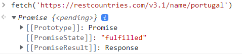
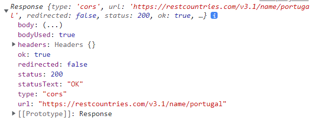
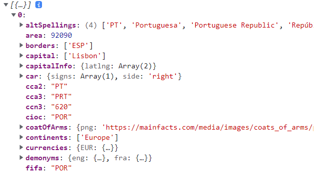
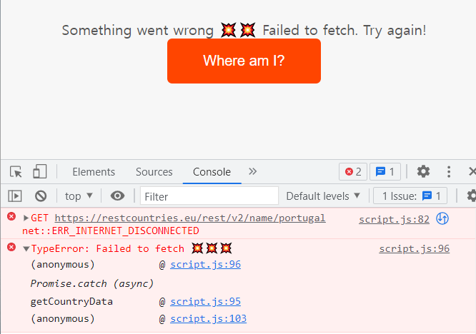
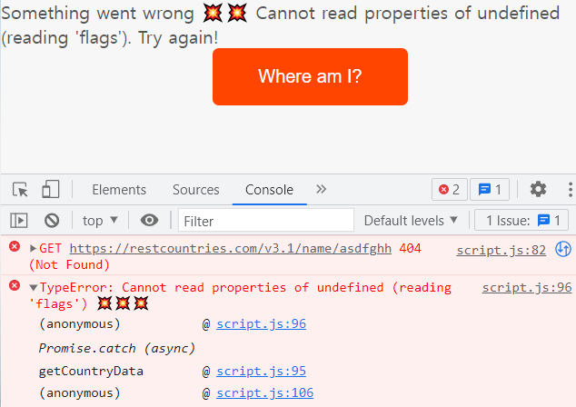
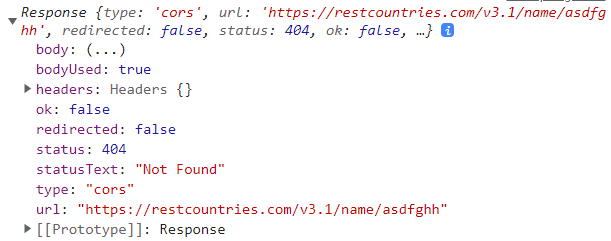

# ✔ '16-Asynchronous' 이론 정리

## ▶ 246. Asynchronous JavaScript, AJAX and APIs

### 🔹 Synchronous Code vs Asynchronous Code

1. Synchronous Code

   - 대부분의 코드는 synchronous code
   - synchronous code는 line by line으로 실행됨
   - 각 code line은 이전 line이 끝날 때까지 기다렸다가 실행됨
   - 실행 시간이 긴 코드는 다음 코드 실행을 막음(block)
   - 각 synchronous code는 순서대로 Thread of Execution에 들어와 실행됨
     - Thread of Execution: 컴퓨터 CPU에서 코드가 실제 실행되는 execution context의 일부분
   - ex) alert 함수 등

2. Asynchronous Code

   - asynchronous code는 'background'에서 task가 끝날 때 실행됨
   - asynchronous code는 다음 코드의 실행을 막지 않음(non-blocking)
   - ex) timer 관련 함수, image loading event, geolocation API, AJAX 호출
   - 주의) callback function이나 addEventListener function 자체가 asynchronous code를 만드는 것이 아님

### 🔹 AJAX

- Asynchronous JavaScript And XML
- 외부 web servers와 비동기 방식으로 communication하는 것
- AJAX 호출을 통해 web servers로부터 데이터를 request할 수 있음
- XML: 과거에 주로 사용되던 data format으로, 요즘엔 XML 대신 JSON이라는 data format을 주로 사용

### 🔹 API

- Application Programming Interface
- 다른 software piece와 communication 가능한 한 software piece
- ex) DOM API, Geolocation API, 자신의 Class API, Online API 등
- Online API: server에서 운영하는 application으로, request data를 받아 response data를 보내줌
- 3rd-party API 예) weather data, flights data, Google Map 등

## ▶ 248. Our First AJAX Call: XMLHttpRequest

- 다양한 open APIs 링크: <https://github.com/public-apis/public-apis>

- 'country' project 설명

  - [REST Countries](https://restcountries.com/) API를 사용해 데이터를 가져올 예정
  - AJAX Call 방법들 중 가장 고전적인 방법인 `XMLHttpRequest`을 이용
  - 특정 country에 대한 국기, 국가명, 지역, 인구, 연어, 화페 데이터를 받아서 화면에 카드 형식으로 나타냄

  ```js
  const getCountryData = function (country) {
    const request = new XMLHttpRequest();
    request.open('GET', `https://restcountries.com/v3.1/name/${country}`);
    request.send();

    request.addEventListener('load', function () {
      const [data] = JSON.parse(this.responseText);
      console.log(data);
      // {name: {…}, tld: Array(1), cca2: 'PT', ccn3: '620', cca3: 'PRT', …}

      const html = `
          <article class="country">
            
            <div class="country__data">
              <h3 class="country__name">${data.name}</h3>
              <h4 class="country__region">${data.region}</h4>
              <p class="country__row"><span>👫</span>${(
                +data.population / 1000000
              ).toFixed(1)} people</p>
              <p class="country__row"><span>🗣️</span>${
                Object.entries(data.languages)[0][1]
              }</p>
              <p class="country__row"><span>💰</span>${
                Object.entries(data.currencies)[0][1].name
              }</p>
            </div>
          </article>
      `;
      countriesContainer.insertAdjacentHTML('beforeend', html);
      countriesContainer.style.opacity = 1;
    });
  };

  getCountryData('portugal');
  getCountryData('usa');
  getCountryData('germany');
  ```

  

- AJAX call은 말그대로 비동기 방식으로 이루어지기 때문에, 'background'에서 데이터를 가져오는 작업이 끝나면 `addEventListener('load')`에 의해 callback function이 실행됨

  - request 순서와는 상관없이 'background'에서 데이터를 가져오는 작업이 먼저 끝나는 대로 callback function이 실행됨
  - 따라서, 위 코드처럼 portugal, usa, germany 순서 request 하더라도 먼저 response된 데이터를 우선적으로 실행되기 때문에 화면에서는 request 순서와는 다르게 country 정보가 나타날 수 있음

### 🔹 XMLHttpRequest

- XMLHttpRequest (XHR) 객체는 서버와 상호작용할 때 사용
- AJAX 프로그래밍에 많이 사용됨
- XML 뿐만 아니라 모든 종류의 데이터를 가져올 수 있음

- `new XMLHttpRequest()`

  - XMLHttpRequest() constructor은 새로운 XMLHttpRequest 객체를 생성함

- `XMLHttpRequest 객체명.open(method, url)`

  - request를 새롭게 초기화하거나, 기존에 존재하던 것을 재초기화함
  - `method`: 사용할 HTTP request method("GET", "POST", "PUT", "DELETE" 등)
  - `url`: request를 보낼 URL string

- `XMLHttpRequest 객체명.send(body)`

  - server에 request를 보냄
  - `body`: XMR request로 보내지는 data body

## ▶ 249. [OPTIONAL] How the Web Works: Requests and Responses

- Request-response model (Client-server architecture)

  - client(브라우저) --`request`-→ web server
  - client(브라우저) ←-`response`-- web server

### 🔹 Request-response 과정

1. client가 특정 URL로 request를 보냄

   - ex) 'https://restcountries.eu/rest/v2/alpha/'
   - `Protocol`: 'HTTP' or 'HTTPS'
   - `Domain name`: 'restcountries.eu'
   - `Resource`: '/rest/v2/alpha/'

2. DNS에 의해 IP 주소로 변환

   - DNS(Domain Name System): 사람이 이해하기 쉬운 domain name을 IP 주소로 변환
   - ex) 'https://104.27.142.889.443'
   - `IP 주소`: '104.27.142.889'
   - `port 번호`: '443'

3. TCP/IP socket connection에 따라 데이터를 주고 받을 수 있음

   - TCP/IP (Transmission Control Protocol/Internet Protocol): 인터넷에서 컴퓨터들이 서로 정보를 주고받는 데 쓰이는 통신규약(프로토콜) 중 하나로 가장 많이 사용됨
   - 응용 계층 ⇆ 전송 계층 ⇆ 인터넷 계층 ⇆ 네트워크 계층

   

4. 브라우저에서 web server로 HTTP Request를 보냄

   - HTTP (HyperText Transfer Protocol): 네트워크 장치 간에 정보를 전송하도록 설계된 '응용(application) 계층' 프로토콜
   - HTTP Request 구성
     - `Start Line`: HTTP method + request target + HTTP version
     - `HTTP request Headers`: host, user-agent, accept-language 등 많은 정보
     - `Request body`: server에 보낼 데이터

5. web server에서 브라우저로 HTTP Response를 보냄

   - HTTP Response 구성
     - `Start Line`: HTTP version + Status code + Status message
     - `HTTP response Headers`: date, content, transfer-encoding 등 많은 정보
     - `Response body`: 브라우저로 보낼 데이터

## ▶ 250. Welcome to Callback Hell

- 특정 country 데이터를 가져와 render한 후, 그 country의 이웃 국가 데이터를 또다시 가져와 render해보자

  - 아래 코드를 보면, 하나의 callback function 안에 또다른 callback function이 있음을 알 수 있음

  ```js
  const renderCountry = function (data, className = '') {
    const html = `
    <article class="country ${className}">
      
      <div class="country__data">
        <h3 class="country__name">${data.name.common}</h3>
        <h4 class="country__region">${data.region}</h4>
        <p class="country__row"><span>👫</span>${(
          +data.population / 1000000
        ).toFixed(1)} people</p>
        <p class="country__row"><span>🗣️</span>${
          Object.entries(data.languages)[0][1]
        }</p>
        <p class="country__row"><span>💰</span>${
          Object.entries(data.currencies)[0][1].name
        }</p>
      </div>
    </article>
    `;
    countriesContainer.insertAdjacentHTML('beforeend', html);
    countriesContainer.style.opacity = 1;
  };
  ```

  ```js
  const getCountryAndNeighbour = function (country) {
    // AJAX call country 1
    const request = new XMLHttpRequest();
    request.open('GET', `https://restcountries.com/v3.1/name/${country}`);
    request.send();

    request.addEventListener('load', function () {
      const [data] = JSON.parse(this.responseText);

      // Render country 1
      renderCountry(data);

      // Get neighbour country 2
      const neighbour = data.borders?.[0]; // country code

      if (!neighbour) return;

      // AJAX call country 2
      const request2 = new XMLHttpRequest();
      request2.open('GET', `https://restcountries.com/v3.1/alpha/${neighbour}`);
      request2.send();

      request2.addEventListener('load', function () {
        const [data2] = JSON.parse(this.responseText);
        // Render country 2
        renderCountry(data2, 'neighbour');
      });
    });
  };

  getCountryAndNeighbour('portugal');
  ```

- callback hell: callback function 안에 callback function 안에 callback function이 연달아 있는 것

  - 코드 가독성이 매우 떨어져 버그가 일어날 가능성이 높은 코드임
  - 해결책: ES6 이후에 출시된 promise

  ```js
  setTimeout(() => {
    console.log('1 second passed');
    setTimeout(() => {
      console.log('2 seconds passed');
      setTimeout(() => {
        console.log('3 second passed');
        setTimeout(() => {
          console.log('4 second passed');
        }, 1000);
      }, 1000);
    }, 1000);
  }, 1000);
  ```

## ▶ 251. Promises and the Fetch API

### 🔹 Fetch API

- ES6에 소개된 AJAX Call의 또다른 방법

- `fetch(resource, options)` method

  - 네트워크 resources를 쉽게 비동기적으로 가져올 수 있음
    - `resource`: fetch하고자하는 resource로, URL string 또는 Request object 가능
    - `options`: method, header, body, mode, credentials, chache, redirect 등 설정값을 담은 object
  - 반환값: **promise 객체**
    - fetch()가 실행되는 즉시 promise 객체가 생성됨
    - fetch() promise는 네트워크 error만 reject할 뿐, HTTP errors (404 등)는 reject하지 않음

  ```js
  console.log(fetch('https://restcountries.com/v3.1/name/portugal'));
  // Promise {<pending>}
  ```

  

### 🔹 Promise

- '미래'의 asynchronously delivered value를 담을 object

  - value ex) AJAX call에 의한 Response

- 이점: events와 callback functions에 의존할 필요가 없음

  - callback functions을 nesting(callback hell)할 필요없이, promises를 chaining함으로써 asynchronous operations을 순서대로 처리 가능

- Promise의 lifecycle

  - `Pending`: future value가 도달하기 '이전' 상태
  - `Settled`: asynchronous task가 끝난 '이후' 상태
  - `Fulfilled`: value를 성공적으로 이용가능한 상태
  - `Rejected`: error가 발생한 상태

  ```
  Pending ---'async task'--→ Settled
                                ↳ Fulfilled
                                ↳ Rejected
  ```

## ▶ 252. Consuming Promises

- Fetch API와 Promise를 이용해서 'country' project를 구현해보자

  - `then()` method는 promise 객체를 받아 지정한 callback function을 실행시켜줌
  - Response는 HTTP 응답 전체를 나타내는 객체로, JSON 본문 콘텐츠를 추출하기 위해서는 `json()` method를 호출해야 함

- `Promise객체.then(onFulfilled, onRejected)`

  - Promise가 fulfilled state일 때와 rejected state일 때 각각을 위한 callback function을 실행함
    - `onFulfilled`: Promise가 fulfilled될 때 호출되는 Function으로, fulfillment value 하나를 인자로 받음
    - `onRejected`: Promise가 rejected될 때 호출되는 Function으로, rejection reason 하나를 인자로 받음
  - 반환값: Promise
    - 항상 promise를 반환하기 때문에, chaining이 가능

  ```js
  const getCountryData = function (country) {
    fetch(`https://restcountries.com/v3.1/name/${country}`)
      .then(function (response) {
        console.log(response);
        // Response {type: 'cors', url: 'https://restcountries.com/v3.1/name/portugal', redirected: false, status: 200, ok: true, …}
        return response.json();
      })
      .then(function (data) {
        console.log(data);
        // [{name: {…}, tld: Array(1), cca2: 'PT', ccn3: '620', cca3: 'PRT', …}]
        renderCountry(data[0]);
      });
  };

  getCountryData('portugal');
  ```

  

  

- `then(onFulfilled, onRejected)` method의 반환값

  - 1. callback function이 value를 반환할 경우, `then`이 반환한 promise는 그 반환값을 자신의 결과값으로 한 'fulfilled' state가 됨
  - 2. callback function이 value를 반환하지 않은 경우, `then`이 반환한 promise는 `undefined`를 자신의 결과값으로 한 'fulfilled' state가 됨
  - 3. callback function 내부에서 error가 발생한 경우, `then`이 반환한 promise는 그 error를 자신의 결과값으로 한 'rejected' state가 됨
  - 4. callback function이 fulfilled promise를 반환할 경우, `then`이 반환한 promise는 그 fulfilled promise의 결과값을 자신의 결과값으로 한 'fulfilled' state가 됨
  - 5. callback function이 rejected promise를 반환할 경우, `then`이 반환한 promise는 그 rejected promise의 결과값을 자신의 결과값으로 한 'rejected' state가 됨
  - 6. callback function이 대기 중인 promise를 반환할 경우, `then`이 반환한 promise는 그 대기 중인 promise의 결과값을 따름

## ▶ 253. Chaining Promises

- promises를 chaining함으로써 이웃 나라의 데이터도 가져와 render해보자

  ```js
  const getCountryData = function (country) {
    // Country 1
    fetch(`https://restcountries.eu/rest/v2/name/${country}`)
      .then(response => response.json())
      .then(data => {
        renderCountry(data[0]);
        const neighbour = data[0].borders?.[0];

        if (!neighbour) return;

        // Country 2
        return fetch(`https://restcountries.eu/rest/v2/alpha/${neighbour}`);
      })
      .then(response => response.json())
      .then(data => renderCountry(data, 'neighbour'));
  };

  getCountryData('portugal');
  ```

## ▶ 254. Handling Rejected Promises

- rejected promise를 처리하는 방법
  - 1. `Promise객체.then(onFulfilled, onRejected)`
  - 2. `Promise객체.catch(onRejected)`

### 🔹 `then(onFulfilled, onRejected)` method 사용해 rejected promise 처리

- 아래 두 개의 fetch promise가 각각 rejected될 경우를 생각해 두 개의 rejected callback function을 작성해야 함

  ```js
  const getCountryData = function (country) {
    // Country 1
    fetch(`https://restcountries.eu/rest/v2/name/${country}`)
      .then(
        response => response.json(),
        err => alert(err)
      )
      .then(data => {
        renderCountry(data[0]);
        const neighbour = data[0].borders?.[0];

        if (!neighbour) return;

        // Country 2
        return fetch(`https://restcountries.eu/rest/v2/alpha/${neighbour}`);
      })
      .then(
        response => response.json(),
        err => alert(err)
      )
      .then(data => renderCountry(data, 'neighbour'));
  };
  ```

### 🔹 `catch(onRejected)` method 사용해 rejected promise 처리

- promise chain 상에서 rejected promise가 있을 때, catch() method 내 callback function이 실행됨

  - `onRejected`: Promise가 rejected될 때 호출되는 Function으로, rejection reason 하나를 인자로 받음

- 반환값: Promise

  - 항상 promise를 반환하기 때문에, chaining이 가능

- 즉, fulfilled promise이면 `then()` callback function이 실행되고, rejected promise이면 chaining `then` methods를 타고 내려가 `catch()` callback function이 실행됨

- fetch() promise는 네트워크 error(ex)오프라인)상황에서 rejected state가 됨

  ```js
  const renderError = function (msg) {
    countriesContainer.insertAdjacentText('beforeend', msg);
    countriesContainer.style.opacity = 1;
  };
  ```

  ```js
  const getCountryData = function (country) {
    // Country 1
    fetch(`https://restcountries.eu/rest/v2/name/${country}`)
      .then(response => response.json())
      .then(data => {
        renderCountry(data[0]);
        const neighbour = data[0].borders?.[0];

        if (!neighbour) return;

        // Country 2
        return fetch(`https://restcountries.eu/rest/v2/alpha/${neighbour}`);
      })
      .then(response => response.json())
      .then(data => renderCountry(data, 'neighbour'))
      .catch(err => {
        console.error(`${err} 💥💥💥`);
        // TypeError: Failed to fetch 💥💥💥
        renderError(`Something went wrong 💥💥 ${err.message}. Try again!`);
      });
  };
  ```

  ```js
  btn.addEventListener('click', function () {
    getCountryData('portugal');
  });
  ```

  

- fetch() promise는 '네트워크 error'만 reject할 뿐, 'HTTP errors (404 등)'는 reject하지 않음

  - 아래처럼 존재하지 않는 country명으로 fetch를 시도한 경우, fetch promise는 rejected되지 않고 then method 내 callback function이 실행되어 HTTP error(404)가 아닌 TypeError가 뜨는 문제가 발생
  - 따라서, HTTP errors는 따로 처리해서 catch로 넘겨줄 필요가 있음

  ```js
  getCountryData('asdfghh');
  // TypeError: Cannot read properties of undefined (reading 'flags') 💥💥💥
  ```

  

### 🔹 `finally(onFinally)` method

- promise 객체가 settled(fulfilled 또는 rejected)되면, finally method 내 callback function가 실행됨

  - `then()` method 나 `catch()` method에서 중복된 코드를 `finally()` method에 적어주면 중복을 제거할 수 있음
  - `onFinally`: Promise가 settled(fulfilled 또는 rejected)될 때 호출되는 Function으로, 인자를 받지 않음

- 반환값: Promise

  - 항상 promise를 반환하기 때문에, chaining이 가능

- fulfilled되었을 때 실행되는 renderCountry() 함수와 rejected되었을 때 실행되는 renderError() 함수에 공통으로 존재하는 코드를 가져와 finally() 내 callback function에 넣어줬음

  ```js
  const getCountryData = function (country) {
    fetch(`https://restcountries.eu/rest/v2/name/${country}`)
      .then(response => ...)
      .then(data => ...)
      .then(response => ...)
      .then(data => ...)
      .catch(err => ...)
      .finally(() => {
        countriesContainer.style.opacity = 1;
      });
  };
  ```

## ▶ 255. Throwing Errors Manually

- 존재하지 않는 country명으로 fetch를 시도했을 때(404 error), rejected promise를 반환하지는 않고 아래와 같이 ok property가 false이고 status가 404인 response을 결과값으로 하는 fulfilled promise를 반환함

  ```js
  const getCountryData = function (country) {
    // Country 1
    fetch(`https://restcountries.eu/rest/v2/name/${country}`)
      .then(response => {
        console.log(response);
        // Response {type: 'cors', url: 'https://restcountries.com/v3.1/name/asdfghh', redirected: false, status: 404, ok: false, …}
        return response.json();
      })
      .then(data => ...)
      .then(response => ...)
      .then(data => ...)
      .catch(err => ...)
      .finally(() => ...);
  };

  getCountryData('asdfghh');
  ```

  

- 존재하지 않는 country명으로 fetch를 시도한 경우, HTTP error(404 error)를 따로 발생시켜서 catch로 넘겨주자

  - `then()` method의 callback function 내부에서 error가 발생한 경우, `then`이 반환한 promise는 그 error를 자신의 결과값으로 한 'rejected' state가 됨
  - rejected promise는 chaining `then` methods를 타고 내려가 `catch()` callback function을 실행하게 됨

- neighbour가 존재하지 않은데 fetch를 시도한 경우에도, HTTP error(404 error)를 따로 발생시켜서 catch로 넘겨주자

  ```js
  const getCountryData = function (country) {
    // Country 1
    fetch(`https://restcountries.eu/rest/v2/name/${country}`)
      .then(response => {
        if (!response.ok)
          throw new Error(`Country not found (${response.status})`);

        return response.json();
      })
      .then(data => {
        renderCountry(data[0]);
        const neighbour = data[0].borders?.[0];

        if (!neighbour) throw new Error('No neighbour found!');

        // Country 2
        return fetch(`https://restcountries.eu/rest/v2/alpha/${neighbour}`);
      })
      .then(response => {
        if (!response.ok)
          throw new Error(`Country not found (${response.status})`);

        return response.json()
        })
      .then(data => renderCountry(data, 'neighbour'))
      .catch(err => ...)
      .finally(() => ...);
  };
  ```

- 특정 country의 데이터를 fetch하고 JSON 본문 콘텐츠를 추출하는 코드를 함수화해 위 코드를 리팩토링해보자

  ```js
  const getJSON = function (url, errorMsg = 'Something went wrong') {
    return fetch(url).then(response => {
      if (!response.ok) throw new Error(`${errorMsg} (${response.status})`);

      return response.json();
    });
  };
  ```

  ```js
  const getCountryData = function (country) {
    // Country 1
    getJSON(
      `https://restcountries.eu/rest/v2/name/${country}`,
      'Country not found'
    )
      .then(data => {
        ...
        // Country 2
        return getJSON(
          `https://restcountries.eu/rest/v2/alpha/${neighbour}`,
          'Country not found'
        );
      })
      .then(data => renderCountry(data, 'neighbour'))
      .catch(err => ...)
      .finally(() => ...);
  };
  ```

### 🔹 Error object

- 런타임 오류가 발생했을 때 새로운 Error 객체가 생성되고 던져짐

  - 사용자 지정 Error 객체를 생성해서 사용할 수도 있음

- JS에는 아래와 같이 일반적인 Error constructor 외에도 여러 개의 중요 오류 constructor가 존재함

  - `ReferenceError`, `SyntaxError`, `TypeError` 등

- `new Error(error massage)`

  - 새로운 Error 객체를 만듦
  - Error 객체를 생성한 후엔 대개 `throw` 키워드를 이용해 던짐
  - `try...catch` 구문을 이용하여 오류를 처리할 수 있음
  - instance property 종류
    - `Error객체명.message`: 오류 메시지
    - `Error객체명.name`: 오류 이름

  ```js
  try {
    throw new Error('이런!');
  } catch (e) {
    console.error(e.name + ': ' + e.message);
    // Error: 이런!
  }
  ```

## ▶ 257. Asynchronous Behind the Scenes: The Event Loop

- `Concurrency model`: JS engine에는 오직 one thread of execution 밖에 없지만, event loop을 통해 동시에 여러 task를 처리할 수 있음

- `브라우저 내 JS runtime` > `JS Engine (Heap + Call Stack)`, `Web APIs`, `Callback Queue`, `MicroTasks Queue`

  - `브라우저 내 JS runtime`: JS code를 실행하기 위해 필요한 모든 pieces를 모아둔 container
  - `Heap`: object가 저장되는 메모리
  - `Call Stack`: code가 실제로 실행되는 곳 (**ONE thread of execution**)
  - `Web APIs`: engine에 제공되는 APIs로, asynchronous tasks가 진행되는 곳 (DOM, Timers, Fetch API 등)
  - `Callback Queue`: 실행될 준비가 된 callback functions
  - `MicroTasks Queue`: 실행될 준비가 된 'promises'와 관련된 callback functions으로, Callback Queue보다 우선순위가 높아 먼저 call stack에 보내어짐
  - `Event Loop`: callbacks queue에 있는 callback function들을 call stack에 보내줌

- ex1) 이미지를 성공적으로 가져오면 event handler(callback function) 실행

  - 과정: Web API에서 비동기로 'dog.jpg'를 가져오려고 함(loading) → 이미지를 성공적으로 가지고 오면, 이미지 load event에 대한 event handler가 Callback Queue로 이동함 → Event Loop에 의해 Callback Queue에 있던 event handler가 Call Stack로 넘어가 execute됨

  ```js
  el = document.querySelector('img');
  el.src = 'dog.jpg';
  el.addEventListener('load', () => {
    el.classList.add('fadeIn');
  });
  ```

- ex2) Fetch API를 이용해 데이터를 가져온 후, then method의 callback function 실행

  - 과정: Web API에서 비동기로 data fetching 시도 → 데이터를 성공적으로 가지고 오면, then method의 callback function이 MicroTasks Queue로 이동함 → Event Loop에 의해 MicroTasks Queue에 있던 callback function이 Call Stack로 넘어가 execute됨

  ```js
  fetch('https://someurl.com/api').then(res => console.log(res));
  ```

## ▶ 258. The Event Loop in Practice

- `setTimeout(callback, time)` function의 두번째 인자인 time value는 callback function을 Callback Queue에 추가하기까지 기다릴 **최소 지연 시간**을 의미

  - Callback Queue에 다른 callback functions이 없고 Call Stack이 비어있다면 setTimeout()의 callback function은 time value만큼 지연된 직후 즉시 Call Stack으로 이동해 execute됨
  - 하지만, Callback Queue에 다른 callback functions이 존재한다면 모두 처리되고 자신의 차례가 올 때까지 기다려야 함
  - 따라서, setTimeout()의 두번째 인자인 time value는 정확한 지연시간이 아닌 최소 지연 시간을 의미함

- Event Loop 예제

  - 비동기적으로 처리되는 setTimeout()과 Promise를 제외한 코드가 가장 먼저 execution됨
  - `Promise.resolve(value)`: value를 결과값으로 하는 fulfilled Promise를 즉시 반환
  - 'setTimeout의 callback function'과 두 'promise에 대한 then callback functions' 이 각각 'Callback Queue'와 'MicroTasks Queue'에 동시에 이동됨
  - MicroTasks Queue가 Callback Queue보다 우선순위가 높기 때문에 Event Loop에 의해 두 promise에 대한 then callback functions이 먼저 Call Stack에 이동해 execute됨
  - 두번째 promise에 대한 then callback function이 실행되는데 오랜 시간이 걸리기 때문에 setTimeout의 callback function이 늦게 실행되는 것을 알 수 있음

  ```js
  console.log('Test start');

  setTimeout(() => console.log('0 sec timer'), 0);

  Promise.resolve('Resolved promise 1').then(res => console.log(res));

  Promise.resolve('Resolved promise 2').then(res => {
    for (let i = 0; i < 1000000000; i++) {}
    console.log(res);
  });

  console.log('Test end');
  // 'Test start'
  // 'Test end'
  // 'Resolved promise 1'
  // 'Resolved promise 2'
  // '0 sec timer'
  ```

## ▶ 259. Building a Simple Promise

- `new Promise(executor)`

  - Promise constructor는 주로 promise를 지원하지 않는 함수를 감쌀 때 사용
  - `executor`: resolve와 reject 함수를 인자로 받아 즉시 실행되는 execution function으로, resolve 및 reject 함수에 인자를 전달하고 호출함 (보통 비동기 작업을 시작한 후 모든 작업을 끝내면 resolve 나 reject 함수를 호출함)
  - `resolve`: Promise를 fulfilled하는 함수
  - `reject`: Promise를 rejected하는 함수

- 랜덤 수가 특정 기준점 이상이면 fulfilled(resolved)되고, 기준점 미만이면 rejected되는 Promise 객체를 직접 만들어보자

  ```js
  const lotteryPromise = new Promise(function (resolve, reject) {
    console.log('Lottery draw is happening 🔮');
    setTimeout(function () {
      if (Math.random() >= 0.5) {
        resolve('You WIN 💰');
      } else {
        reject(new Error('You lost your money 💩'));
      }
    }, 2000);
  });

  lotteryPromise.then(res => console.log(res)).catch(err => console.error(err));
  ```

- Promise constructor는 주로 setTimeout 등과 같은 함수를 감싸 `promisifying`하기 위해 사용됨

  - 아래와 같이 promise를 사용하면 callback hell을 피할 수 있음
  - 아래 wait 함수는 promise를 즉시 반환하는데, 반환한 promise는 지정한 시간 후에 fulfilled 됨

  ```js
  const wait = function (seconds) {
    return new Promise(function (resolve) {
      setTimeout(resolve, seconds * 1000);
    });
  };

  wait(1)
    .then(() => {
      console.log('1 second passed');
      return wait(1);
    })
    .then(() => {
      console.log('2 second passed');
      return wait(1);
    })
    .then(() => {
      console.log('3 second passed');
      return wait(1);
    })
    .then(() => console.log('4 second passed'));
  ```

- `Promise.resolve(value)`

  - value를 결과값으로 하는 fulfilled Promise를 즉시 반환
  - `value`: Promise에 의해 결정되는 인자
  - 반환값: fulfilled Promise

  ```js
  Promise.resolve('abc').then(x => console.log(x));
  ```

- `Promise.reject(reason)`

  - reason을 결과값으로 하는 rejected Promise를 즉시 반환
  - `reason`: 이 Promise를 거부한 이유
  - 반환값: rejected Promise

  ```js
  Promise.reject(new Error('Problem!')).catch(x => console.error(x));
  ```

## ▶ 260. Promisifying the Geolocation API

- Geolocation API를 promisifying하는 함수를 만들어보자

  - 아래 getPosition 함수는 promise를 즉시 반환하는데, 반환한 promise는 Geolocation API가 성공적으로 위치 정보를 가지고 오면 fulfilled되고 위치 정보를 가지고 오는 것을 실패하면 rejected 됨

  ```js
  const getPosition = function () {
    return new Promise(function (resolve, reject) {
      navigator.geolocation.getCurrentPosition(resolve, reject);
    });
  };

  getPosition().then(pos => console.log(pos));
  ```

- 사용자의 위치 정보를 가지고 온 후, 해당 위치가 어느 country에 위치하는지 찾고, 해당 country 데이터를 가지고 와 화면에 나타내보자

  - Promisifying한 Geolocation API, Fetch API 사용

  ```js
  const whereAmI = function () {
    getPosition()
      .then(pos => {
        const { latitude: lat, longitude: lng } = pos.coords;

        return fetch(`https://geocode.xyz/${lat},${lng}?geoit=json`);
      })
      .then(res => {
        if (!res.ok) throw new Error(`Problem with geocoding ${res.status}`);
        return res.json();
      })
      .then(data => {
        return fetch(`https://restcountries.eu/rest/v2/name/${data.country}`);
      })
      .then(res => {
        if (!res.ok) throw new Error(`Country not found (${res.status})`);
        return res.json();
      })
      .then(data => renderCountry(data[0]))
      .catch(err => console.error(`${err.message} 💥`));
  };

  btn.addEventListener('click', whereAmI);
  ```

## ▶ 262. Consuming Promises with Async/Await

- ES 2017에 도입된 문법
- 위에서 promise, then을 이용한 방법과 동일하지만, 좀 더 직관적이고 간단한 코드로 작성 가능 (synthetic sugar)

- `Async/Await` function

  - `async` function 선언은 AsyncFunction객체를 반환하는 하나의 비동기 함수를 정의
  - `async` 함수는 항상 promise를 반환
  - `async` 함수에는 `await` 식이 포함될 수 있는데, `await` 식을 만나면 `async` 함수의 실행을 일시 중지하고 전달된 Promise의 해결을 기다리는 역할을 함
  - `await` 키워드는 `async` 함수에서만 유효함

- 위에서 작성한 whereAmI() 함수코드를 리팩토링해보자

  - 사용자의 위치 정보를 가지고 오기 → 해당 위치가 어느 country에 위치하는지 찾기 → 해당 country 데이터를 가지고 와 화면에 나타내기
  - whereAmI() 함수는 비동기 함수이므로, 콘솔창에 'FIRST'가 먼저 찍히게 됨

  ```js
  const whereAmI = async function () {
    // Geolocation
    const pos = await getPosition();
    const { latitude: lat, longitude: lng } = pos.coords;

    // Reverse geocoding
    const resGeo = await fetch(`https://geocode.xyz/${lat},${lng}?geoit=json`);
    const dataGeo = await resGeo.json();

    // Country data
    const res = await fetch(
      `https://restcountries.eu/rest/v2/name/${dataGeo.country}`
    );
    const data = await res.json();
    renderCountry(data[0]);
  };

  whereAmI();
  console.log('FIRST');
  ```

## ▶ 263. Error Handling With try...catch

- `try...catch...finally`

  - try문에 실행할 코드블럭을 표시하고 예외(exception)가 발생(throw)할 경우, catch문에서 응답할 코드를 지정
  - `try_statements`: 실행될 선언들
  - `catch_statements`: try 블록에서 예외가 발생했을 때 실행될 선언들
  - `exception_var`: catch 블록과 관련된 예외 객체를 담기 위한 식별자
  - `finally_statements`: try 선언이 완료된 이후에 실행된 선언들 (예외 발생 여부와 상관없이 실행됨)

  ```js
  try {
    try_statements
  }
  [catch (exception_var) {
    catch_statements
  }]
  [finally {
    finally_statements
  }]
  ```

- `try...catch` 문을 사용해 Async/Await 함수 내에서 error를 처리하자

  - 네트워크 error를 제외한 HTTP error(404 등)는 reject되지 않기 때문에 따로 처리줘야 함
  - getPosition()은 위치 정보를 가지고 오는데 실패하면 rejected Promise를 반환하기 때문에 따로 에러 처리를 해줄 필요가 없음

  ```js
  const whereAmI = async function () {
    try {
      ...
      // Reverse geocoding
      const resGeo = await fetch(`https://geocode.xyz/${lat},${lng}?geoit=json`);

      if (!resGeo.ok) throw new Error('Problem getting location data');

      const dataGeo = await resGeo.json();

      // Country data
      const res = await fetch(
        `https://restcountries.eu/rest/v2/name/${dataGeo.country}`
      );

      if (!res.ok) throw new Error('Problem getting country');

      const data = await res.json();
      renderCountry(data[0]);
    } catch (err) {
      console.error(`${err} 💥`);
      renderError(`💥 ${err.message}`);
    }
  };
  ```

## ▶ 264. Returning Values from Async Functions

- `async` 함수는 항상 promise를 반환

  ```js
  const whereAmI = async function () {
      try {
        ...
        return `You are in ${dataGeo.city}, ${dataGeo.country}`;
      } catch (err) {
        ...
      }
    };
  ```

  ```js
  console.log('1: Will get location');

  const city = whereAmI();
  console.log(`2: ${city}`);

  console.log('3: Finished getting location');
  // '1: Will get location'
  // Promise {<pending>}
  // '3: Finished getting location'
  ```

- Async/Await 함수가 background에서 진행 완료 후 반환될 때까지 기다렸다가, 1/2/3 순서대로 코드가 실행되게 해보자

  - 문제점) Async/Await 함수 내에서 error가 발생해 catch문 안에 있는 코드가 실행되더라도 Async/Await 함수는 'undefined'를 결과값으로 하는 fulfilled state가 되어, then() method의 callback function이 실행됨
  - 해결방법) Async/Await 함수의 catch문 내에서 다시 error를 던져주어 rejected Promise를 반환하게 해야함

  ```js
  const whereAmI = async function () {
      try {
        ...
        return `You are in ${dataGeo.city}, ${dataGeo.country}`;
      } catch (err) {
        ...
        // Reject promise returned from async function
        throw err;
      }
    };
  ```

  ```js
  console.log('1: Will get location');

  whereAmI()
    .then(city => console.log(`2: ${city}`))
    .catch(err => console.error(`2: ${err.message} 💥`))
    .finally(() => console.log('3: Finished getting location'));
  ```

- 하지만 위 코드는 promise-then과 Async/Await 문법이 섞여 보기에 좋지 못한 코드이므로, IIFE를 사용해 오로지 Async/Await만으로 다시 구현해보자

  ```js
  console.log('1: Will get location');

  (async function () {
    try {
      const city = await whereAmI();
      console.log(`2: ${city}`);
    } catch (err) {
      console.error(`2: ${err.message} 💥`);
    }
    console.log('3: Finished getting location');
  })();
  ```

## ▶ 265. Running Promises in Parallel

- 서로 다른 세 나라에 대한 데이터를 가져와 각 나라의 수도를 배열에 담아 반환하는 함수를 만들어보자

  - 아래 코드처럼 세 나라 각각에 await를 붙여서 가지고 오면, 순서대로 데이터를 가져오게 됨
  - 세 데이터는 서로 의존성이 없음에도 불구하고 순서대로 데이터를 가지고 오면 시간적으로 손해임

  ```js
  const get3Countries = async function (c1, c2, c3) {
    try {
      const [data1] = await getJSON(
        `https://restcountries.com/v3.1/name/${c1}`
      );
      const [data2] = await getJSON(
        `https://restcountries.com/v3.1/name/${c2}`
      );
      const [data3] = await getJSON(
        `https://restcountries.com/v3.1/name/${c3}`
      );

      console.log([data1.capital[0], data2.capital[0], data3.capital[0]]);
      // ['Lisbon', 'Ottawa', 'Dodoma']
    } catch (err) {
      console.error(err);
    }
  };

  get3Countries('portugal', 'canada', 'tanzania');
  ```

### 🔹 `Promise.all(iterable)`

- iterable 객체에 주어진 모든 promise를 fulfilled한 후, 각 promise에 대한 결과를 나타내는 배열을 반환

  - combinator functions(여러 promise를 결합하는 함수) 중 하나
  - `iterable`: Array와 같이 순회 가능한 객체

- 반환값: Promise

  - all method의 fulfilled Promise 결과값은 iterable 객체의 각 promise 결과값을 담은 배열임
  - 입력 값으로 들어온 Promise 중 하나라도 rejected되면 Promise.all()은 즉시 rejected되고 rejected reason이 Promise의 결과값이 됨

  ```js
  const p = Promise.all([1, 2, 3, Promise.resolve(444)]);

  setTimeout(function () {
    console.log(p); // Promise {<fulfilled>: Array(4)}
  }, 1000);
  ```

  ```js
  const p1 = Promise.resolve(3);
  const p2 = 1337;
  const p3 = new Promise((resolve, reject) => {
    setTimeout(() => {
      resolve('foo');
    }, 100);
  });

  Promise.all([p1, p2, p3]).then(values => {
    console.log(values); // [3, 1337, "foo"]
  });
  ```

- 의존성이 없는 세 개 나라 데이터를 동시간에 가지고 와 시간을 단축시켜보자

  ```js
  const get3Countries = async function (c1, c2, c3) {
    try {
      const data = await Promise.all([
        getJSON(`https://restcountries.com/v3.1/name/${c1}`),
        getJSON(`https://restcountries.com/v3.1/name/${c2}`),
        getJSON(`https://restcountries.com/v3.1/name/${c3}`),
      ]);

      console.log(data);
      // [Array(1), Array(1), Array(1)]
      console.log(data.map(d => d[0].capital[0]));
      // ['Lisbon', 'Ottawa', 'Dodoma']
    } catch (err) {
      console.error(err);
    }
  };

  get3Countries('portugal', 'canada', 'tanzania');
  ```

## ▶ 266. Other Promise Combinators: race, allSettled and any

### 🔹 `Promise.race(iterable)`

- iterable 객체에 주어진 모든 promise 중 가장 먼저 완료(settled)된 promise 하나를 반환

  - `iterable`: Array와 같이 순회 가능한 객체

- 반환값: Promise

  - 주어진 iterable에서 처음으로 fulfilled되거나 rejected된 promise를 반환

  ```js
  (async function () {
    const res = await Promise.race([
      getJSON(`https://restcountries.com/v3.1/name/italy`),
      getJSON(`https://restcountries.com/v3.1/name/egypt`),
      getJSON(`https://restcountries.com/v3.1/name/mexico`),
    ]);

    console.log(res[0]);
    // {name: {…}, tld: Array(1), cca2: 'IT', ccn3: '380', cca3: 'ITA', …}
  })();
  ```

- 인터넷 환경이 불안정한 사용자 디바이스의 경우, 데이터를 fetch하는 시간이 기약없이 길어지는 것을 방지하기 위해서 일정 시간이 지나면 데이터를 가져오는 것을 포기하도록 `Promise.race()`를 사용하기도 함

  ```js
  const timeout = function (sec) {
    return new Promise(function (_, reject) {
      setTimeout(function () {
        reject(new Error('Request took too long!'));
      }, sec * 1000);
    });
  };

  Promise.race([
    getJSON(`https://restcountries.com/v3.1/name/tanzania`),
    timeout(5),
  ])
    .then(res => console.log(res[0]))
    .catch(err => console.error(err));
  ```

### 🔹 `Promise.allSettled(iterable)`

- ES2020에 도입된 문법

- iterable 객체에 주어진 모든 promise를 fulfilled하거나 rejected한 후, 각 promise에 대한 결과를 나타내는 배열을 반환

  - `iterable`: Array와 같이 순회 가능한 객체
  - 일반적으로 서로에 대한 의존성이 없는 여러 비동기 작업을 동시간에 수행해야 하거나, 항상 각 프로미스의 실행 결과를 알고 싶을 때 사용
  - iterable 객체 중 하나라도 rejected가 있을 때 즉시 rejected되는 `Promise.all()`와는 달리, `Promise.allSettled()`는 rejected도 배열에 함께 반환됨

- 반환값: Promise

  - allSettled method의 Promise 결과값은 iterable 객체의 각 promise 결과값을 담은 배열임

  ```js
  Promise.allSettled([
    Promise.resolve('Success'),
    Promise.reject('ERROR'),
    Promise.resolve('Another success'),
  ]).then(res => console.log(res));
  // [{status: 'fulfilled', value: 'Success'},
  //  {status: 'rejected', reason: 'ERROR'},
  //  {status: 'fulfilled', value: 'Another success'}]
  ```

  ```js
  Promise.all([
    Promise.resolve('Success'),
    Promise.reject('ERROR'),
    Promise.resolve('Another success'),
  ])
    .then(res => console.log(res))
    .catch(err => console.error(err));
  // ERROR
  ```

### 🔹 `Promise.any(iterable)`

- ES2021에 도입된 문법

- iterable 객체에 주어진 모든 promise 중 가장 먼저 fulfilled된 promise 하나를 반환

  - `iterable`: Array와 같이 순회 가능한 객체

- 반환값: Promise

  - 주어진 iterable에서 처음으로 fulfilled된 promise를 반환

  ```js
  Promise.any([
    Promise.resolve('Success'),
    Promise.reject('ERROR'),
    Promise.resolve('Another success'),
  ])
    .then(res => console.log(res))
    .catch(err => console.error(err));
  // Success
  ```
