# ✔ '17-Modern JS Modules Tooling' 이론 정리

## ▶ 271. An Overview of Modules in JavaScript

- Modern JS Development 과정: `Development` → `Build` → `Production`

- `NPM`: Node Package Manager

  - 3rd-party package(React, jQuery, Leaflet 등)를 포함하고 있음
  - application build를 도와줄 development tools(live-server, Parcel, Babel 등)을 포함하고 있음

1. Development

   - 코드를 여러 modules로 쪼개고 3rd-party package를 사용해서 개발

2. Build Process

   - `Bundling` → `Transpiling/Polyfilling` 두 단계로 구성
     - `Bundling`: 여러 modules를 하나의 파일로 만드는 과정
     - `Transpiling/Polyfilling`: 최신 JS 문법을 지원하지 않는 오래된 브라우저를 위해 modern JS 코드를 ES5로 전환시켜주는 과정 👉 `Babel`
   - Build Tools: `Webpack` or `Parcel`

3. Production

   - 배포를 위한 JS Bundle 필요

## ▶ 271. An Overview od Modules in JavaScript

### 🔹 Module

- encapsulate 되어 있는 재사용 가능한 코드
- 보통 하나의 파일로 구성되어, 또다른 모듈을 import(dependency)하거나 자신의 특정 변수를 export(public API)할 수 있음
- Module의 특징
  - Compose software: 복잡한 applications을 구성하는 작은 building blocks임
  - Isolate components: 전체 코드에 대한 이해없이 독립적으로 개발됨
  - Abstract code: 모듈 내 자세한 코드에 대해서 알 필요없이 가져와 사용 가능
  - Organized code
  - Reuse code: 다양한 프로젝트에서 쉽게 재사용 가능함

### 🔹 ES6 Modules

- ES6 Modules

  - 한 파일당 하나의 module을 의미
  - `import`, `export` 키워드 존재
  - ES6 이전에는 modules이 존재하지 않아 여러 scripts를 생성해 모듈과 유사하게 사용했음

- ES6 Modules vs Script

  - 1. ES6 Module 내 최상위 변수들은 module scope에 위치하기 때문에 다른 모듈에서 직접적으로 접근이 불가한 반면, Script 내 최상위 변수들은 global scope에 위치하기 때문에 다른 스크립트에서 무의식적으로 변수를 조작할 위험이 큼 (콘솔창에서도 모듈 내 특정 요소에 접근 불가)

  - 2. ES6 Module는 기본적으로 Strict mode인 반면, Script는 따로 최상단에 Strict mode 설정을 해줘야 함

  - 3. ES6 Module에서 최상위 `this`는 undefined이지만, Script에서 최상위 `this`는 window 객체를 가리킴

  - 4. ES6 Module는 `import`/`export`가 존재하지만, Script에서는 해당 키워드를 사용할 수 없음

  - 5. ES6 Module는 script 태그에 type 속성을 따로 적어줘야 하지만, Script는 필요 없음

  - 6. ES6 Module 파일을 asynchronous한 방식으로 다운받아지지만, Script 파일은 `defer`나 `async` 속성을 추가하지 않는 한 기본적으로 synchronous한 방식으로 다운받아짐

    |                     |        ES6 Module        |   Script    |
    | :-----------------: | :----------------------: | :---------: |
    | Top-level variables |     Scoped to module     |   Global    |
    |    Default mode     |       Strict mode        | Sloppy mode |
    |  Top-level `this`   |        undefined         |   window    |
    | Imports and exports |           Yes            |     No      |
    |    HTML linking     | `<script type='module'>` | `<script>`  |
    |  File downloading   |       Asynchronous       | Synchronous |

### 🔹 ES6 Module이 import되는 방법

- Parsing `index.js` → execution 전 modules import → Execution `index.js`

  ```js
  // index.js
  import { rand } from './math.js';
  import { showDice } from './dom.js';

  const dice = rand(1, 6, 2);
  showDice(dice);
  ```

1. Parsing `index.js`

   - `index.js` 파일을 가져와 읽음(reading)

2. execution 전 modules import

   - `math.js`/`dom.js`를 Asynchronous 방식으로 다운로드 → `math.js`/`dom.js`의 exports를 `index.js`의 imports와 연결 → `math.js`/`dom.js` execution
   - top-level imports는 hoisting 됨
   - modules는 synchronous 방식으로 import됨
   - 이 과정은 bundling과 dead code elimination을 가능하게 함
   - `index.js`의 imports는 `math.js`/`dom.js`의 exports의 변수들을 reference할 뿐 복사되지 않음
     - 따라서, `math.js`/`dom.js`의 exports의 변수들의 값이 바뀌면 자동으로 `index.js`의 imports의 값도 바뀜 (live connection)

3. Execution `index.js`

   - `index.js` 파일 실행

## ▶ 272. Exporting and Importing in ES6 Modules

- `script.js`/`shoppingCart.js` modules을 생성해보자

  - module 이름은 camel case로 작성해야 함 (by convention)
  - 모듈 파일을 HTML에 연결시키기 위해선, `type='module'` 속성을 반드시 추가해야 함
  - import한 `shoppingCart.js` 모듈이 `script.js`보다 먼저 execution되는 것을 알 수 있음

  ```html
  <script type="module" src="script.js"></script>
  ```

  ```js
  // soppingCart.js
  console.log('Exporting module');
  ```

  ```js
  // script.js
  import './shoppingCart.js';

  console.log('Importing module');
  // 'Exporting module'
  // 'Importing module'
  ```

- module을 import/export하는 방법은 두가지임

  - 1. `Named` import/export
  - 2. `Default` import/export

1. `Named` import/export

   - `export` 키워드 필요

   - `export const addToCart`처럼 변수명 앞에다 바로 export 키워드를 써줄 수도 있고, `export { totalPrice, totalQuantity }`처럼 따로 변수명을 가져와 써줄 수도 있음

     - 두번째 방식이 더 선호되는 방법임

     ```js
     // soppingCart.js
     const shippingCost = 10;
     const cart = [];

     export const addToCart = function (product, quantity) {
       cart.push({ product, quantity });
       console.log(`${quantity} ${product} added to cart`);
     };

     const totalPrice = 237;
     const totalQuantity = 23;

     export { totalPrice, totalQuantity };
     ```

   - 중괄호 안에 가져오고자 하는 변수명을 반드시 '동일'하게 기입해 import 할 수 있음

     ```js
     // script.js
     import { addToCart, totalPrice, totalQuantity } from './shoppingCart.js';

     addToCart('bread', 5);
     // 5 bread added to cart
     console.log(totalPrice, totalQuantity);
     // 237 23
     ```

   - `as` 키워드를 사용해 변수명을 다른 이름으로 변경해서 import/export 가능

     ```js
     // soppingCart.js
     ...
     export { totalPrice, totalQuantity as tq };
     ```

     ```js
     // script.js
     import {
       addToCart,
       totalPrice as price,
       totalQuantity,
     } from './shoppingCart.js';

     console.log(price, tq);
     // 237 23
     ```

   - `* as [name]`을 사용하면 `soppingCart.js` 모듈이 export하는 모든 변수를 가져와 `name`이라는 객체에 저장이 됨

     ```js
     // script.js
     import * as ShoppingCart from './shoppingCart.js';

     ShoppingCart.addToCart('bread', 5);
     // 5 bread added to cart
     console.log(ShoppingCart.totalPrice);
     // 237
     ```

2. `Default` import/export

   - 하나의 파일(모듈)당 하나의 default export만 존재 가능

   - `export` 와 `default` 키워드 필요

   - 변수명 앞에다 바로 `export default`를 적어줄 수도 있고, 따로 변수명을 가져와 적어줄 수도 있음

     ```js
     // soppingCart.js
     ...
     export default function (product, quantity) {
      cart.push({ product, quantity });
      console.log(`${quantity} ${product} added to cart`);
     }
     ```

   - default 변수명은 export 변수명과 동일하게 작성할 필요가 없음

     ```js
     // script.js
     import add from './shoppingCart.js';

     add('bread', 5);
     // 5 bread added to cart
     ```

   - 아래와 같이 Named와 Default를 혼용해서 import할 수는 있지만 추천하지는 않음

     ```js
     // script.js
     import add, {
       addToCart,
       totalPrice as price,
       tq,
     } from './shoppingCart.js';
     ```

   - 아래 코드를 통해 import 변수는 export 변수를 reference할 뿐, copy한 것이 아님을 알 수 있음

     ```js
     // script.js
     import add, { cart } from './shoppingCart.js';

     add('pizza', 2);
     add('bread', 5);
     add('apples', 4);

     console.log(cart);
     // [{product: 'pizza', quantity: 2}, {...}, {...}],
     ```

## ▶ 273. Top-Level await (ES2022)

- ES2022에 도입된 문법

- **오직 module 안에서만** `async` function 밖에서도 `await` 사용 가능 (Top-Level await)

- 단점1) `await` 식을 만나게 되면 해결이 될 때까지 module execution이 잠시 block됨

  - [JSONPlaceholder](https://jsonplaceholder.typicode.com/): 가짜 data를 가져올 수 있는 free fake API

  ```js
  // script.js
  console.log('Start fetching');

  const res = await fetch('https://jsonplaceholder.typicode.com/posts');
  const data = await res.json();
  console.log(data);

  console.log('Something');
  // Start fetching
  // Array(100) [{...}, {...}, ...]
  // Something
  ```

- 단점2) Top-level await를 사용하는 module을 import하는 module도 modules이 모두 execution할 때까지 기다렸다가 나중에 본인이 execution하므로 execution이 잠시 blocking됨

  ```js
  // shoppingCart.js
  console.log('Start fetching users');
  await fetch('https://jsonplaceholder.typicode.com/users');
  console.log('Finish fetching users');
  ```

  ```js
  // script.js
  import add from './shoppingCart.js';
  // Start fetching users
  // Finish fetching users

  add('bread', 5);
  // 5 bread added to cart
  ```

- 장점) `async` function의 return value를 변수에 따로 저장하고 싶을 때 유용

  ```js
  // script.js
  const getLastPost = async function () {
    const res = await fetch('https://jsonplaceholder.typicode.com/posts');
    const data = await res.json();

    return { title: data.at(-1).title, text: data.at(-1).body };
  };
  ```

  ```js
  // 옳지 못한 코드!
  const lastPost = getLastPost();

  console.log(lastPost);
  // Promise {<pending>}
  ```

  ```js
  // 올바른 코드
  const lastPost2 = await getLastPost();

  console.log(lastPost2);
  // {title: ..., text: ...}
  ```

## ▶ 274. The Module Pattern

- Module Pattern: 특정 구성요소를 다른 구성요소와 독립적으로 유지하는 패턴

- ES6 module이 도입되기 이전엔, script에서 module과 유사한 module pattern을 사용하기도 했음

- `IIFE`를 사용하면 module처럼 encapsulation하여 private data를 가지거나 특정 요소를 반환하여 public API로 둘 수 있음

  ```js
  // script.js
  const ShoppingCart2 = (function () {
    const cart = [];
    const shippingCost = 10;
    const totalPrice = 237;
    const totalQuantity = 23;

    const addToCart = function (product, quantity) {
      cart.push({ product, quantity });
      console.log(
        `${quantity} ${product} added to cart (sipping cost is ${shippingCost})`
      );
    };

    const orderStock = function (product, quantity) {
      console.log(`${quantity} ${product} ordered from supplier`);
    };

    return {
      addToCart,
      cart,
      totalPrice,
      totalQuantity,
    };
  })();
  ```

  ```js
  ShoppingCart2.addToCart('apple', 4);
  // 4 apple added to cart (sipping cost is 10)
  ShoppingCart2.addToCart('pizza', 2);
  // 2 pizza added to cart (sipping cost is 10)

  console.log(ShoppingCart2);
  // {cart: Array(2), totalPrice: 237, totalQuantity: 23, addToCart: ƒ}
  console.log(ShoppingCart2.shippingCost);
  // undefined (private 요소는 접근 불가!)
  ```

## ▶ 275. CommonJS Modules

- ES6 module, Module Pattern 이외에 `node.js`에서 주로 사용되던 module system인 CommonJS Module이 있음

  - node.js: 브라우저가 아닌 서버에서의 JS runtime
  - npm은 다양한 modules repository로써, 여기에 있는 많은 modules이 여전히 CommonJS Module system을 따르고 있음

- CommonJS Modules은 ES6 module처럼 한 파일이 하나의 모듈임

  - `export.변수명`을 통해 export 가능하고, `require()` 함수를 사용해 import 가능

  ```js
  // Export
  export.addTocart = function (product, quantity) {
    cart.push({ product, quantity });
    console.log(
      `${quantity} ${product} added to cart (sipping cost is ${shippingCost})`
    );
  };
  ```

  ```js
  // Import
  const { addTocart } = require('./shoppingCart.js');
  ```

## ▶ 276. A Brief Introduction to the Command Line

| 명령어(윈도우) | 명령어(MacOS, 리눅스) | 설명                        | 예시                           |
| -------------- | --------------------- | --------------------------- | ------------------------------ |
| cd             | cd                    | 디렉토리 변경               | cd 디렉토리명                  |
| dir            | ls                    | 디렉토리/파일 목록을 보여줌 | dir                            |
| move           | mv                    | 파일을 이동                 | move 파일명 이동할\_디렉토리명 |
| mkdir          | mkdir                 | 디렉토리 생성               | mkdir 디렉토리명               |
| del            | rm                    | 디렉토리/파일 삭제          | del 디렉토링명                 |

## ▶ 277. Introduction to NPM

- NPM(Node Package Manager)은 우리 컴퓨터의 software이자 package repository임
- script 태그를 이용(CDN)해 HTML에 외부 라이브러리를 연결할 때의 단점 (= Package Manager을 사용해야하는 이유)
  - 1. 라이브러리 내 variables는 global variables로 노출되게 됨
  - 2. HTML 로딩을 할 때마다 라이브러리 내 모든 JS 파일들을 다운로드해야 하므로, 로딩에 많은 시간이 걸림
  - 3. 라이브러리가 새로운 버전을 업데이트한 경우, 직접 script 태그 링크를 변경해줘야하는 번거러움이 있음
- 즉, NPM과 같은 package repository가 없었을 때에는, 일일이 패키지를 설치해주고 관리해줘야 하는 불편함이 있었음
- [node.js 공식 홈페이지](https://nodejs.org/ko/download)에서 `npm` 설치

- npm 설치 확인 명령어

  ```bash
  $ npm -v
  ```

- NPM을 사용하고자 하는 각각의 project에서 초기화(initialize) 해줘야 함

  - init 명령 후, package.json 파일을 생성하기 위한 몇가지 질문에 대한 답변을 해야 함
  - 모든 질문에 대한 답변을 하면 project 폴더 내에 `package.json` 파일이 생성됨

  ```bash
  $ npm init
  ```

  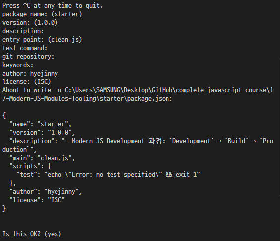

  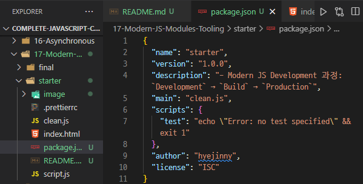

- NPM을 이용해 leaflet 라이브러리를 설치해보자

  - [leaflet - download](https://leafletjs.com/download.html)
  - 아래와 같은 명령어로 라이브러리를 설치하면 두 가지 변화가 나타남
    - 1. `package.json` 파일에 dependencies 필드가 생성되고 'leaflet'이 추가됨
    - 2. `node_modules` 폴더가 생성되고 그 안에 leaflet 폴더가 추가됨
  - 아래와 같은 명령어로 설치한 leaflet 라이브러리는 CommonJS module system을 따르기 때문에 `module bundler` 없이 특정 모듈을 직접 import해서 사용할 수는 없음

  ```bash
  $ npm install leaflet
  ```

  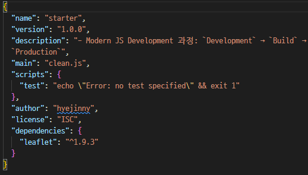

  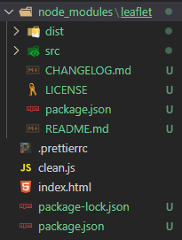

- NPM을 이용해 Lodash 라이브러리를 설치해보자

  - Lodash 라이브러리: modern JavaScript utility library
  - [Lodash - download](https://lodash.com/), [lodash-es download](https://www.npmjs.com/package/lodash-es?activeTab=readme)
  - 아래와 같은 명령어로 라이브러리를 설치하면, ES6 module system을 따르기 때문에 특정 모듈을 import해서 사용 가능

  ```bash
  $ npm i lodash-es
  ```

  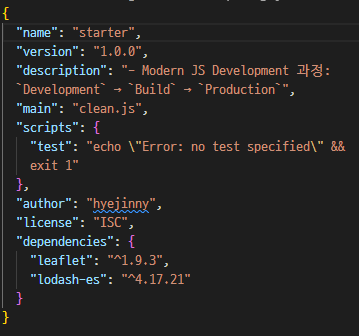

  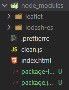

- Lodash 라이브러리 내 'cloneDeep.js' 모듈을 import해서 사용해보자

  - `Object.assign()` method를 사용하면 object를 shallow copy 가능
  - 'cloneDeep.js' 모듈 내 `cloneDeep()` 함수를 사용하면, object를 deep copy 가능

  ```js
  // script.js
  import cloneDeep from './node_modules/lodash-es/cloneDeep.js';

  const state = {
    cart: [
      { product: 'bread', quantity: 5 },
      { product: 'pizza', quantity: 5 },
    ],
    user: { loggedIn: true },
  };
  ```

  ```js
  const stateClone = Object.assign({}, state);
  const stateDeepClone = cloneDeep(state);

  state.user.loggedIn = false;

  console.log(stateClone);
  // {cart: Array(2), user: {loggedIn: false}}
  console.log(stateDeepClone);
  // {cart: Array(2), user: {loggedIn: true}}
  ```

- 내가 생성한 이 project를 다른 컴퓨터로 copy하거나, git에 저장할 때 `node_modules` 폴더에 있는 파일들은 옮길 필요가 없음

  - 많은 패키지를 담고 있기 때문에 용량이 커 옮기는데 시간이 오래 걸림
  - 대신, 아래 명령어를 이용해 `package.json`의 dependencies 필드에 기록된 모든 패키지를 새로 설치하면 됨

  ```bash
  $ npm install
  ```

## ▶ 278. Bundling With Parcel and NPM Scripts

- module bundler tools: `Parcel`, `Webpack` 등
- Parcel도 또한 NPM을 통해 설치 가능함

  - `--save-dev`을 붙여 설치하게 되면, `package.json` 내에 'devDependencies' 필드가 새로 생성되고 'parcel'이 추가됨
  - 'devDependencies'는 우리가 생성한 application의 build tools을 저장함
  - 즉, 우리의 코드에 실제 import해서 사용되는 패키지들은 'dependencies' 필드에 저장되고, app을 개발하는데 필요한 패키지들은 'devDependencies' 필드에 저장됨

  ```bash
  $ npm i parcel --save-dev
  ```

  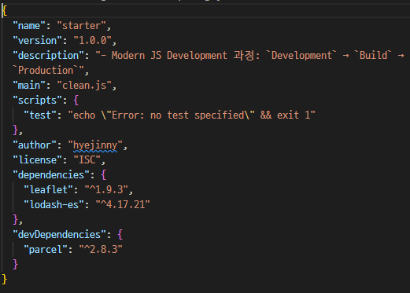

  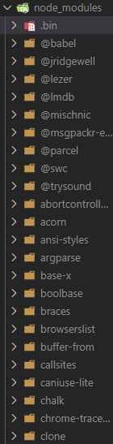

- npm을 통해 우리 app에 locally 설치된 parcel을 시작(build)해보자 (두 가지 방법)

  - 1. `NPX` 이용

    ```bash
    $ npx parcel index.html
    ```

  - 2. `NPM script` 이용

    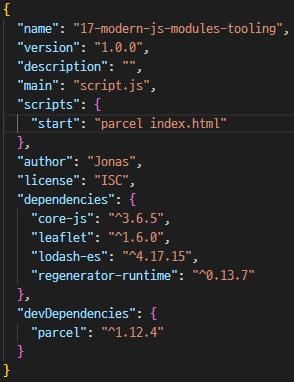

    ```bash
    $ npm run start
    ```

- parcel을 시작하면 `.parcel-cache`와 `dist` 폴더가 생성됨

  - `dist` 폴더에 'script.js', 'shoppingCart.js', 'cloneDeep.js' 세 파일이 하나로 합쳐진(bundle) 파일과 새로운 'index.html'이 생성된 것을 확인할 수 있음
  - parcel은 또한 'live-server'처럼 새로운 development server를 시작하게 됨 (보통 port 1234)

  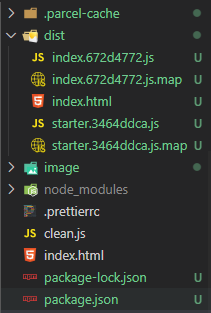

  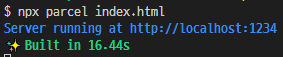

- parcel은 간단하게 하나의 script 파일을 만들어주기 때문에, HTML에서 js 파일을 연결할 때 script 태그 안에 `type=module` 속성은 빼야 함

  ```html
  <script defer src="script.js"></script>
  ```

- hot module reloading을 활성화하면, modules 내 코드를 수정할 때마다 자동으로 rebuild되어 새로 bundle을 생성하고 페이지 reload 없이 코드가 실행됨

  - 아래 코드는 오로지 parcel만 이해 가능하고, 마지막 bundle에는 아래 코드가 포함되지 않음

  ```js
  // script.js
  if (module.hot) {
    module.hot.accept();
  }
  ```

- module bundlers에서 특정 module을 import할 때 경로를 자세히 적을 필요없이 라이브러리명만 명시해줘도 됨

  - js 파일뿐만 아니라 HTML, CSS, SAS, images 등의 파일도 마찬가지임
  - ES6 module뿐만 아니라 CommonJS module도 마찬가지임

  ```js
  // index.js
  import cloneDeep from './node_modules/lodash-es/cloneDeep.js'; // X
  import cloneDeep from 'lodash-es'; // O
  ```

- 개발을 완료했으면 final bundle을 build해야 함 (두 가지 방법)

  - final bundle은 코드를 압축하고 dead code를 제거한 형태임
  - 1. `NPX` 이용

    ```bash
    $ npx parcel build index.html
    ```

  - 2. `NPM script` 이용

    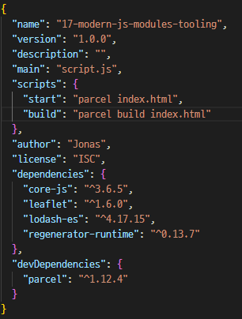

    ```bash
    $ npm run build
    ```

## ✔ 279. Configuring Babel and Polyfilling

- Transpiling and Polyfilling: 오래된 브라우저를 사용하는 사용자를 위해, 새로운 문법이나 함수를 구 표준 문법으로 변경해주는 것을 의미

### 🔹 Transpiling

- ES6+의 새로운 문법을 ES5 문법으로 변경
- Transpile tool: `Babel`

  - [Babel 공식 홈페이지](https://babeljs.io/)
  - [plugins](https://babeljs.io/docs/plugins-list)을 사용해 직접 특정 문법에 대한 transpiler를 설치해도 되고, [presets](https://babeljs.io/docs/presets)(plugins의 모음)을 사용해 여러 문법에 대한 transpilers를 한번에 설치 가능

- `Parcel`과 같은 build system은 babel 기능을 포함하고 있어 자동으로 코드를 transpile해줌

  - 하지만, Experiment와 같은 단계에 있는 일부 문법들은 final presets에 포함되지 않아 Parcel에 의해 자동으로 transpile되지 않을 수 있기 때문에, 이러한 문법들은 따로 plugin을 설치해서 transpile해줘야 함
  - `Parcel v1` Transpiling ex) `let`/`const` → `var`, arrow function → regular function, template literal → concat method

    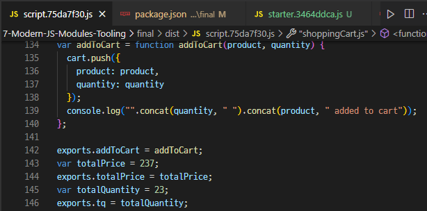

### 🔹 Polyfilling

- 새로운 functions을 기존 function을 수정하거나 새롭게 구현하여 기능하게끔 함
  - Babel은 오로지 ES6+ 문법들(arrow function, classes, const, spread operator 등)만 ES5 문법으로 변환시켜줄 뿐, methods나 Promise와 같은 특징들은 변환시켜주지 못함
- Polyfill tool: `core js`, `regenerator-runtime`(Polyfilling async functions)

- `core-js` 라이브러리 설치 후, stable 모듈을 import해서 사용 가능

  ```js
  import 'core-js/stable';
  // import 'core-js/stable/array/find';
  // import 'core-js/stable/promise';

  import 'regenerator-runtime/runtime';
  ```

  ```js
  console.log(cart.find(el => el.quantity >= 2));
  Promise.resolve('TEST').then(x => console.log(x));
  ```

  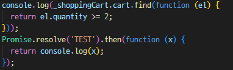

  

## ✔ 280. Review: Writing Clean and Modern JavaScript

1. READABLE CODE

   - 나뿐만 아니라 다른 개발자들도 쉽게 이해할 수 있는 코드를 작성하자
   - 지나치게 clever한 solution은 피하자
   - descriptive한 변수명과 함수명을 사용하자

2. GENERAL

   - DRY 원칙을 지키자
   - encapsulation을 통해 global namespace를 오염시키지 말자
   - `var` 사용 금지
   - strong type checks (===, !==)를 사용하자

3. FUNCTIONS

   - 일반적으로 함수는 하나의 기능만 수행해야함
   - function parameter를 3개 이상 사용하지 말자
   - 가능하다면 default parameter를 설정하자
   - 일반적으로 input data type과 동일한 type의 값을 반환해야함
   - arrow function을 적절히 사용해 more readable code로 만들어주자

4. OOP

   - ES6 classes를 사용하자
   - class 외부에서 데이터를 mutate하지 않도록 encapsulate하자
   - method chaining이 가능하게 구현하자
   - methods로 arrow function을 절대 사용하지 말자

5. AVOID NESTED CODE

   - if code block을 사용하는 대신 조건에 부합하지 않으면 early return해버리자 (guard clauses)
   - if/else문을 사용하는 대신 ternary(conditional) 또는 logical operators를 사용하자
   - if/else-if문을 사용하는 대신 여러 개의 if문을 두자
   - for loops을 사용하는 대신 array methods를 사용하자
   - callback-based asynchronous API를 피하자

6. ASYNCHRONOUS CODE

   - Promise with then method 대신 Promise with async/await을 사용하자
   - async data가 서로 의존하지 않는다면, Promise.all function을 사용해 parallel하게 데이터를 가지고 오자
   - errors와 promise rejections 처리 필수

## ✔ 282. Declarative and Functional JavaScript Principles

### 🔹 Imperative Code vs Declarative Code

- 코드를 작성하는 근본적인 방법(paradigms)으로 크게 Imperative Code와 Declarative Code가 있음

1. Imperative Code

   - `How to do things`를 설명함
   - 컴퓨터에게 step by step을 설명해줘야 함

   ```js
   const arr = [2, 4, 6, 8];
   const doubled = [];
   for (let i = 0; i < arr.length; i++) {
     doubled[i] = arr[i] * 2;
   }
   ```

2. Declarative Code

   - `What to do things`를 설명함
   - 컴퓨터에게 추상적으로 설명해줘야 함

   ```js
   const arr = [2, 4, 6, 8];
   const doubled = arr.map(n => n * 2);
   ```

### 🔹 Functional Programming

- Declarative programming paradigm
- side effects와 data mutations을 피하고, 여러 pure functions을 결합해 소프트웨어를 구축해나가는 방식

  - `side effect`: function 밖에 있는 데이터를 변경(mutation)
    - ex) 외부 변수를 mutate, 콘솔 로깅, DOM 작성 등
  - `pure function`: side effects가 없는 function으로, 같은 inputs이 주어지면 항상 같은 outputs를 내놔야 함
  - `immutability`: state(data)는 절대로 변경되지 않고, copied state가 mutate되거나 반환됨

1. FUNCTIONAL PROGRAMMING TECHNIQUES

   - 되도록이면 data mutations을 피하자
   - side effect를 발생하지 않는 built-in methods를 사용하자
   - `map()`, `filter`, `reduce`와 같은 methods를 사용해 data transformation을 하자

2. DECLARATIVE SYNTAX

   - array/object destructuring을 사용하자
   - spread operator를 사용하자
   - ternary(conditional) operator를 사용하자
   - template literals을 사용하자
